# Robotic Surface Heating

A ROS 2 system for autonomous, closed-loop thermal conditioning of a surface. A
Universal Robots UR10e holds a hot-air tool while an array of FLIR thermal
cameras reconstructs a live 3D temperature field. A planning layer continuously
identifies the coldest region of the target surface and directs the arm to heat
it, repeating until the surface reaches a uniform temperature.

---

## Table of contents

1. [Overview](#1-overview)
2. [What this project achieves](#2-what-this-project-achieves)
3. [ROS 2 concepts used here](#3-ros-2-concepts-used-here)
4. [System architecture](#4-system-architecture)
5. [Runtime pipeline](#5-runtime-pipeline)
6. [Controllers compared: Greedy vs. MPC](#6-controllers-compared-greedy-vs-mpc)
7. [Project structure](#project-structure)
8. [Source files by package (detailed reference)](#7-source-files-by-package-detailed-reference)
9. [Configuration](#8-configuration)
10. [Starting a new "move-only" project](#9-starting-a-new-move-only-project)
11. [Driving the arm from a custom model](#10-driving-the-arm-from-a-custom-model)
12. [Quick start  running the heating demo](#11-quick-start--running-the-heating-demo)
13. [Full research paper](#12-full-research-paper)

---

## 1. Overview

The system runs a single control loop. Thermal cameras observe the surface, the
perception layer locates the coldest region, the planner converts that region
into a target pose, and the arm moves there and applies heat. As each cold spot
warms, a new coldest region appears, and the loop continues until the surface is
evenly heated.


---

## 2. What this project achieves

This work automates a process that is normally manual: bringing a surface to a
uniform target temperature with a robot-mounted heat gun. The contribution is
that **both the trajectory and the heating intensity are controlled together** —
prior automated approaches move the tool but leave intensity fixed.

**System built**

- A **TRIAC-based intensity stage** (custom PCB) that modulates the 1500 W heat
  gun via phase-angle firing, giving continuous, repeatable control of delivered
  power. Open-loop characterization is monotonic and repeatable across the firing
  range.
- A **multi-camera FLIR Lepton thermal pipeline** that fuses several thermal
  views into a single live 3D temperature field, with URDF-based occlusion
  masking so the arm itself is removed from the reconstruction.
- A **physics-based thermal model** (2D finite-difference heat diffusion with a
  moving Gaussian source) fit offline in PyTorch and validated against an
  NVIDIA Warp solver. The model lets the planner predict how heat will spread.
- A **closed-loop planning layer** that re-plans continuously and drives the arm
  toward whichever region is coldest or out of band.

**Headline result**

A head-to-head experiment compared three controllers on a planar composite panel
(10 mm analysis grid, 40–50 °C target band, firing clamped to 25–65 %, five
trials per policy). The adaptive controller (**MPC Dynamic**) holds **87–90 % of
the surface inside the target band at steady state, versus ~55 % for the
static baseline** — roughly a 1.6× improvement in uniform coverage.

---

## 3. ROS 2 concepts used here

The software is organized as a set of independent processes called **nodes**.
Nodes do not call each other directly; they exchange data over named channels.

- **Publisher** — a node that writes messages to a topic.
- **Subscriber** — a node that reads messages from a topic.
- **Topic** — a named, typed message channel (for example `/coldest_pose`). Any
  node may publish or subscribe to it.
- **Service** — a request/response call: a node sends a request and blocks until
  it receives a reply.
- **TF tree** — the live coordinate-frame graph describing where every link of
  the robot and every camera sits in space.

---

## 4. System architecture

The stack is layered from the physical hardware down to the software that drives
it. Each layer depends only on the one above it.


---

## 5. Runtime pipeline

The diagram below shows the nodes that run during a live demo and the topics
that connect them.


### Key topics

| Topic | Payload | Publisher | Subscriber |
|---|---|---|---|
| `/thermal_camera_*/image_raw` | Raw thermal images | Camera publisher | Point-cloud coloration |
| `/raw_thermal_pointcloud` | 3D points with temperature | Point-cloud coloration | Brain, surface picker |
| `/colored_cad_pointcloud` | Colored cloud for RViz | Point-cloud coloration | RViz |
| `robot_mask` | Pixels belonging to the arm | `robot_mask_pub` | Point-cloud coloration |
| `/selected_surface_points` | The selected target surface | Surface picker | Brain, data collectors |
| `/coldest_pose`, `/hottest_pose` | Extremum pose + temperature | Brain | Robot interface |
| `/robot_target_pose` | Target pose for the arm | Brain | Robot interface |
| `/joint_states` | Current joint angles | Robot driver | Mask, coloration |

### Custom messages

- **`Extrema`** — header, a list of poses, and a scalar `value` (temperature).
  Used to communicate cold/hot spots.
- **`RobotMask`** — header plus camera images marking where the robot occupies
  the frame.
- **`PoseToPlan`** (service) — accepts a position and orientation, returns
  `success: true/false`.

---

## 6. Controllers compared: Greedy vs. MPC

The planning layer is the part that decides *where to heat next*, and the project
evaluated three strategies. They differ in whether they use a thermal model and
whether they reason about the future.

### The three policies

| Policy | Uses a model? | Plans ahead? | Intensity | File |
|---|---|---|---|---|
| **Greedy** | No | No | Fixed firing % | `greedy_replanner.py` |
| **MPC Static** | Yes | Yes (4 s horizon) | One fixed % per plan | `mpc_test_1.py` / `extrema_pub_modular.py` |
| **MPC Dynamic** | Yes | Yes (4 s horizon) | Varies along the path | `continuous_replanner.py` |

### How Greedy works

Find the coldest cell in the fused grid, point the heat gun at it, fire at a
fixed percentage, repeat. No model, no horizon, no temporal reasoning. Two
failure modes follow directly:

- **Oscillation (spatial pathology).** Once the coldest cell warms, a neighbor
  becomes coldest, so the arm jumps back and forth across a cluster of cold
  cells, never letting any of them stabilize.
- **Overshoot (temporal pathology).** A fixed firing percentage with no temporal
  authority means cells the arm dwells over blow past the target band.

### How MPC works

Re-plan every 2 seconds over a 4-second horizon:

1. Read the fused thermal grid.
2. Sample *K* candidate target cells (cold or out of band).
3. Fit *K* B-spline paths from the current end-effector pose to each target.
4. Roll out every candidate forward 4 s under the learned thermal model
   (batched GPU rollout).
5. Score each with the cost function below.
6. Execute the first 2 s of the winning plan, then re-plan.

The cost function balances getting on-temperature against smooth, short paths:

```
J = J_temp + λ_c · J_curv + λ_l · J_len
```

**MPC Static** uses one fixed firing percentage per plan. **MPC Dynamic** lets
the firing percentage vary along the trajectory, which is what gives it temporal
authority over each cell.

### Results

| Policy | Time to band | Steady-state in-band coverage |
|---|---|---|
| Greedy | — (overshoots, never stabilizes) | low / unstable |
| MPC Static | **58.6 s** (SD 5.1 s) | ~55 % |
| MPC Dynamic | 85.8 s (SD 7.3 s) | **87–90 %** |

The apparent paradox is the point: **MPC Static reaches the band *faster*, but
MPC Dynamic *stays* in band**. Time-to-band is only half the story — Static
enters quickly but then drifts out (temporal pathology), while Dynamic, by
varying intensity along the path, solves both the oscillation (spatial) and the
drift (temporal) problems. Jointly optimizing trajectory *and* intensity is what
delivers uniform coverage.

---

## Project structure

A map of every Python file, grouped by package. Legend: **● live · ○ experimental / legacy · ◆ shared helper.**

```text
robot_surface_heating/
└── src/
    ├── thermal_camera/                    # sensing, perception, planning (core)
    │   ├── config/
    │   │   ├── camera_params.yaml
    │   │   ├── pnp_calibration_config.yaml
    │   │   ├── cad_register_config.yaml
    │   │   └── pcl_params.yaml
    │   └── thermal_camera/
    │       │  # --- camera acquisition ---
    │       ├── ● publisher_thermal.py             # reads FLIR cameras, publishes thermal images
    │       ├── ◆ uvctypes.py                      # libuvc Python bindings
    │       ├── ● uvc_visualize.py                 # live 2D thermal viewer (per camera)
    │       ├── ○ uvc-radiometry_2.py              # older single-camera viewer
    │       ├── ○ realsense_calib_test.py          # RealSense depth test (off main path)
    │       │  # --- calibration & frames ---
    │       ├── ● camera_frame_broadcaster.py      # publishes camera poses to TF
    │       ├── ● pnp_extrinsic.py                 # extrinsic calibration (click correspondences)
    │       ├── ○ extrinsic.py                     # alternate extrinsic calibration
    │       ├── ○ thermal-intrinsic-calibration.py # per-camera intrinsic calibration
    │       ├── ● bundle_adjustment.py             # joint refinement of all camera poses
    │       ├── ◆ transform_formatting.py          # transform formatting helper
    │       │  # --- 3D thermal reconstruction ---
    │       ├── ● pointcloud_coloration.py         # projects thermal pixels to 3D (multi-cam)
    │       ├── ○ pointcloud_coloration_single.py  # single-camera variant
    │       ├── ○ thermal_pointcloud.py            # early prototype
    │       ├── ● robot_mask_pub.py                # masks arm pixels from coloration
    │       ├── ● virtual_camera_viewer.py         # virtual arm view from joint angles
    │       ├── ○ mask_playback.py                 # replays saved masks
    │       ├── ● realtime_masked_visualizer.py    # live masked thermal grid
    │       │  # --- CAD model ---
    │       ├── ● cad_visualization.py             # loads CAD/STL, displays in RViz
    │       ├── ◆ cad_registration.py              # registers CAD to live cloud
    │       ├── ● stl_to_lattice.py                # STL surface -> targetable point grid
    │       ├── ○ stl_to_lattice_old1.py           # older version
    │       ├── ○ txt_to_lattice.py                # lattice from text dump (experimental)
    │       ├── ○ txt_processing.py                # text model processing (experimental)
    │       │  # --- planning: extremum detection & policies ---
    │       ├── ● extrema_pub.py                    # primary planner -> /robot_target_pose
    │       ├── ● extrema_pub_modular.py           # configurable planner + coverage metric
    │       ├── ○ extrema_pub_curobo.py            # cuRobo GPU-planner variant
    │       ├── ○ coldest_pose_pub.py              # older standalone coldest-spot publisher
    │       ├── ● hottest_temp_pub.py              # publishes hottest temperature value
    │       ├── ● greedy_replanner.py              # greedy policy (nearest cold spot)
    │       ├── ● continuous_replanner.py          # adaptive re-planning policy
    │       ├── ○ continuous_replanner_old*.py     # 6 legacy versions
    │       ├── ● zigzag_policy.py                 # zig-zag sweep policy
    │       ├── ● optimize_single_real.py          # single-step optimizer (learned model)
    │       ├── ○ optimize_single_real_old6.py     # older version
    │       ├── ● mpc_test_1.py                    # model-predictive-control experiment
    │       ├── ◆ single_horizon.py                # single-step math for MPC/optimizer
    │       ├── ◆ adhesive_single.py               # material/heat-transfer helper
    │       ├── ◆ learned_model_util.py            # loads learned thermal model
    │       ├── ● thermal_model_reader.py          # trains/uses the thermal model
    │       │  # --- surface selection & paths ---
    │       ├── ● o3d_visual_surface.py            # interactive surface picker
    │       ├── ○ o3d_visual_surface_old1.py       # older picker
    │       ├── ○ o3d_visual_surface_old2.py       # older picker
    │       ├── ● heater_path_to_cartesian.py      # heating path -> 3D waypoints
    │       ├── ● heating_path_data_collection.py  # builds/serves heating path (services)
    │       ├── ◆ common_motionplan_utilities.py   # shared motion math (normals, offsets)
    │       ├── ● debug_surface_normals.py         # surface-normal debug overlay
    │       │  # --- heat-gun control ---
    │       ├── ● heat_gun_controller.py           # sets heat-gun power via Arduino (serial)
    │       ├── ● heater_manual.py                 # manual terminal heat-gun control
    │       ├── ○ arduino_dummy.py                 # mock Arduino for testing
    │       │  # --- recording & replay ---
    │       ├── ● thermal_data_collector.py        # records cloud + poses to rosbag
    │       ├── ● rosbag_reader.py                 # rosbag -> .npz dataset
    │       ├── ○ traj_rosbag_reader.py            # rosbag -> dataset + trajectories
    │       ├── ● thermal_rerun.py                 # streams recorded data to Rerun viewer
    │       ├── ● live_temp_plotter.py             # live surface-temperature plot
    │       ├── ○ temp_data_analysis.py            # one-off .npz plotting
    │       ├── ○ timestamp_comparator.py          # checks camera timestamp alignment
    │       ├── ◆ read_write_pkl.py                # pickle read/write helper
    │       └── ○ pyrender_urdf_test.py            # URDF rendering test
    │
    ├── robot_interface/                    # arm execution
    │   └── robot_interface/
    │       ├── ● overheat_safety_robot_interface.py # primary executor (MoveIt + safety)
    │       ├── ● demo_robot_interface.py          # executor for the RSS demo
    │       ├── ● modular_executor.py              # configurable executor (debug topics)
    │       ├── ● dual_robot_interface.py          # controls two arms
    │       ├── ● heater_path_executor.py          # executes a full heating path
    │       ├── ● lightweight_executor.py          # minimal executor — START HERE for custom nodes
    │       ├── ● lightweight_executor_heat_gun.py # minimal executor + heat gun
    │       ├── ○ lightweight_executor_old.py      # older version
    │       ├── ◆ moveit_waitable.py               # awaits MoveIt async results
    │       ├── ◆ curobo_planner.py                # optional cuRobo (GPU) planner wrapper
    │       ├── ○ moveit_test.py                   # MoveIt Cartesian-planning demo
    │       ├── ● live_temp_plotter.py             # live temperature plot
    │       ├── ○ async_node.py                    # minimal example node
    │       ├── ○ execute.py                       # example PoseToPlan client
    │       ├── ○ dump.py                          # scratch/dev interface
    │       ├── ○ gripper_test_node.py             # gripper test
    │       ├── ○ test_robot_interface.py          # test executor
    │       ├── ○ test_robot_interface_new.py      # test executor
    │       ├── ○ rin_boilerplate_code.py          # starter template
    │       └── ○ toy_executor_stub.py             # mock executor (no real robot)
    │
    ├── thermal_camera_interfaces/          # message definitions only
    │   └── msg/
    │       ├── Extrema.msg
    │       └── RobotMask.msg
    │
    ├── lerobot_interface/                  # optional LeRobot bridge
    │   └── lerobot_interface/
    │       └── ○ robot_control_node.py            # bridge to a LeRobot-style arm
    │
    ├── fake_gripper_publisher/             # simulated gripper
    │   └── fake_gripper_publisher/
    │       └── ○ fake_joint_state_publisher.py    # fake gripper joint states for sim
    │
    └── (vendored, off-the-shelf — mostly launch/setup files)
        ├── ur_robot_driver/                       # UR ROS 2 driver
        ├── Universal_Robots_ROS2_Description/     # robot URDF + meshes
        └── thermal_moveit_config/                 # MoveIt config for this cell
```

## 7. Source files by package (detailed reference)

Legend: **● live system · ○ experimental / legacy (safe to ignore while
learning) · ◆ shared helper imported by other files.**

### `thermal_camera` — sensing, perception, and planning (core)

**Camera acquisition**

| File | Description |
|---|---|
| ● `publisher_thermal.py` | Reads the FLIR thermal cameras and publishes thermal images. |
| ◆ `uvctypes.py` | Python bindings to the camera USB library (`libuvc`). |
| ● `uvc_visualize.py` | Live 2D thermal viewer windows, one per camera. |
| ○ `uvc-radiometry_2.py` | Older single-camera viewer experiment. |
| ○ `realsense_calib_test.py` | RealSense depth-camera test (not on the main path). |

**Camera calibration and frames**

| File | Description |
|---|---|
| ● `camera_frame_broadcaster.py` | Publishes each camera's pose to TF. |
| ● `pnp_extrinsic.py` | Extrinsic calibration: click corresponding points to recover each camera's pose. |
| ○ `extrinsic.py` | Alternate/older extrinsic calibration. |
| ○ `thermal-intrinsic-calibration.py` | Per-camera intrinsic (lens) calibration. |
| ● `bundle_adjustment.py` | Joint refinement of all camera poses for higher accuracy. |
| ◆ `transform_formatting.py` | Transform formatting/cleanup helper. |

**3D thermal reconstruction**

| File | Description |
|---|---|
| ● `pointcloud_coloration.py` | Projects thermal pixels onto 3D points (multi-camera). |
| ○ `pointcloud_coloration_single.py` | Single-camera variant. |
| ○ `thermal_pointcloud.py` | Early prototype of the thermal cloud. |
| ● `robot_mask_pub.py` | Identifies arm pixels so they are excluded from coloration. |
| ● `virtual_camera_viewer.py` | Renders a virtual camera view of the arm from joint angles (used for masking). |
| ○ `mask_playback.py` | Replays saved masks for testing. |
| ● `realtime_masked_visualizer.py` | Live view of the masked thermal grid. |

**CAD model**

| File | Description |
|---|---|
| ● `cad_visualization.py` | Loads the part's CAD/STL model and displays it in RViz. STL path is set here. |
| ◆ `cad_registration.py` | Registers the CAD model against the live point cloud. |
| ● `stl_to_lattice.py` | Converts an STL surface into a grid of targetable points. |
| ○ `stl_to_lattice_old1.py` | Older version of the above. |
| ○ `txt_to_lattice.py` / `txt_processing.py` | Build/process lattices from text model dumps (experimental). |

**Planning — extremum detection and policies**

| File | Description |
|---|---|
| ● `extrema_pub.py` | Primary planner: locates the coldest and hottest spots, publishes `/robot_target_pose`. |
| ● `extrema_pub_modular.py` | Configurable planner that also publishes greedy targets and in-band coverage. |
| ○ `extrema_pub_curobo.py` | Planner variant using the cuRobo GPU planner. |
| ○ `coldest_pose_pub.py` | Older standalone coldest-spot publisher. |
| ● `hottest_temp_pub.py` | Publishes the single hottest temperature value. |
| ● `greedy_replanner.py` | Greedy policy: always heat the nearest cold spot next. |
| ● `continuous_replanner.py` | Adaptive policy: re-plans the path as the surface heats. |
| ○ `continuous_replanner_old*.py` | Six legacy versions of the continuous policy. |
| ● `zigzag_policy.py` | Sweeps the tool over the surface in a zig-zag pattern. |
| ● `optimize_single_real.py` | Optimizes a single heating step using a learned thermal model. |
| ○ `optimize_single_real_old6.py` | Older version of the above. |
| ● `mpc_test_1.py` | Model-predictive-control heating experiment. |
| ◆ `single_horizon.py` | Single-step math helper for the MPC/optimizer. |
| ◆ `adhesive_single.py` | Material/heat-transfer helper for the planners. |
| ◆ `learned_model_util.py` | Loads the learned thermal (heat-diffusion) model. |
| ● `thermal_model_reader.py` | Reads recorded data and trains/uses the thermal model. |

**Surface selection and paths**

| File | Description |
|---|---|
| ● `o3d_visual_surface.py` | Interactive picker for selecting the surface to heat. |
| ○ `o3d_visual_surface_old1.py` / `_old2.py` | Older versions of the picker. |
| ● `heater_path_to_cartesian.py` | Converts a heating path into 3D robot waypoints. |
| ● `heating_path_data_collection.py` | Builds/serves a heating path; offers `/select_heating_path` and `/publish_heating_path` services. |
| ◆ `common_motionplan_utilities.py` | Shared motion math (e.g. tool offset along surface normals). |
| ● `debug_surface_normals.py` | Debug overlay of surface-normal arrows. |

**Heat-gun control**

| File | Description |
|---|---|
| ● `heat_gun_controller.py` | Sets heat-gun power via the Arduino over serial, based on heat metrics. |
| ● `heater_manual.py` | Manual terminal control of the heat gun. |
| ○ `arduino_dummy.py` | Mock Arduino for hardware-free testing. |

**Data recording and replay**

| File | Description |
|---|---|
| ● `thermal_data_collector.py` | Records the live cloud and robot poses to a rosbag. |
| ● `rosbag_reader.py` | Reads a rosbag and exports it as an `.npz` dataset. |
| ○ `traj_rosbag_reader.py` | As above, also saving trajectory/joint data. |
| ● `thermal_rerun.py` | Streams recorded data into the Rerun 3D viewer. |
| ● `live_temp_plotter.py` | Live temperature plot for the selected surface. |
| ○ `temp_data_analysis.py` | One-off `.npz` plotting script. |
| ○ `timestamp_comparator.py` | Checks camera timestamp alignment. |
| ◆ `read_write_pkl.py` | Small pickle read/write helper for debugging. |
| ○ `pyrender_urdf_test.py` | URDF rendering test with pyrender. |

### `robot_interface` — arm execution

| File | Description |
|---|---|
| ● `overheat_safety_robot_interface.py` | Primary executor: subscribes to `/robot_target_pose`, plans with MoveIt, moves the arm with safety checks. |
| ● `demo_robot_interface.py` | Executor used in the full RSS demo. |
| ● `modular_executor.py` | Configurable executor wired to debug topics and the heating path. |
| ● `dual_robot_interface.py` | Controls two arms simultaneously. |
| ● `heater_path_executor.py` | Executes a full heating path with the heat gun. |
| ● `lightweight_executor.py` | Minimal, fast executor. **Best reference when writing a custom move node.** |
| ● `lightweight_executor_heat_gun.py` | Minimal executor that also toggles the heat gun. |
| ○ `lightweight_executor_old.py` | Older version. |
| ◆ `moveit_waitable.py` | Helper for awaiting MoveIt async results. |
| ◆ `curobo_planner.py` | Optional cuRobo (GPU) motion-planner wrapper. |
| ○ `moveit_test.py` | MoveIt Cartesian-planning demo. |
| ● `live_temp_plotter.py` | Live temperature plot, runnable from this package. |
| ○ `async_node.py` | Minimal example node subscribing to `debug_cold_pose`. |
| ○ `execute.py` | Example client for the `PoseToPlan` service. |
| ○ `dump.py` | Scratch/dev version of the robot interface. |
| ○ `gripper_test_node.py` | Gripper test. |
| ○ `test_robot_interface.py` / `_new.py` | Test executors that publish `/robot_target_pose`. |
| ○ `rin_boilerplate_code.py` | Starter template. |
| ○ `toy_executor_stub.py` | Mock executor (no real robot). |

### `thermal_camera_interfaces` — message definitions

Message definitions only (`Extrema.msg`, `RobotMask.msg`). No runtime logic;
`__init__.py` is empty.

### `lerobot_interface` — optional LeRobot bridge

| File | Description |
|---|---|
| ○ `robot_control_node.py` | Bridge to a LeRobot-style arm. Optional, not part of the heating demo. |
| | `test_copyright/flake8/pep257.py` are auto-generated lint tests. |

### `fake_gripper_publisher` — simulated gripper

| File | Description |
|---|---|
| ○ `fake_joint_state_publisher.py` | Publishes fake gripper joint states so the robot model is complete in simulation. |

### Vendored packages

`ur_robot_driver`, `Universal_Robots_ROS2_Description`, and
`thermal_moveit_config` are standard, off-the-shelf Universal Robots / MoveIt
packages. Their Python files are mostly launch and setup scripts that start the
driver, load the robot URDF, and configure MoveIt. **Do not remove the
description package** — the arm requires it to know its own geometry.

---

## 8. Configuration

Most behavior is configurable without code changes. In
`src/thermal_camera/config/`:

| File | Settings |
|---|---|
| `camera_params.yaml` | `camera_count` and `extrinsics_prefix` (which calibration to load). |
| `pnp_calibration_config.yaml` | `camera_count` and the output path for new calibrations. |
| `cad_register_config.yaml` | CAD registration settings. |
| `pcl_params.yaml` | Point-cloud filtering settings. |

In `cad_visualization.py`, the line `STL_FILE_PATH = ".../RSS_v3.stl"` selects
which part's CAD model is loaded.

---

## 9. Starting a new "move-only" project

To build a clean project that only moves the UR arm — without any thermal or
heating code — keep the robot-driving foundation and remove the rest. Motion
control itself is provided off the shelf by the Universal Robots ROS 2 driver
and MoveIt; you do not write a driver. The heating code sits entirely on top of
that foundation.


### Keep — the robot-driving foundation

| Package | Role | Why keep |
|---|---|---|
| `ur_robot_driver` | Connects ROS to the UR10e and exposes its controllers. | This is the driver. |
| `Universal_Robots_ROS2_Description` | Robot URDF and meshes (geometry, joints, limits). | The arm needs its own model. |
| `thermal_moveit_config` *(optional, rename)* | MoveIt config for this cell. | Keep for ready-made motion planning; rename to drop "thermal". |

### Drop — heating-specific packages

`thermal_camera`, `thermal_camera_interfaces`, `lerobot_interface`,
`fake_gripper_publisher`, **and `robot_interface`**.

> **Do not reuse `robot_interface` as-is.** Its executors (e.g.
> `overheat_safety_robot_interface.py`) import `thermal_camera_interfaces` and
> `common_motionplan_utilities`, so they will not build once the thermal
> packages are removed. Use them only as a reference for how to call MoveIt, then
> write a clean node of your own.

### Recommended workspace layout

```
my_new_robot_ws/
└── src/
    ├── ur_robot_driver/                       # the driver
    ├── Universal_Robots_ROS2_Description/     # robot body (URDF/meshes)
    ├── thermal_moveit_config/  (renamed)      # motion planning (optional)
    └── my_robot_task/                         # your new code
        ├── package.xml
        ├── setup.py
        └── my_robot_task/
            └── move_node.py                   # decides where to move
```

### Moving the arm in three steps

**1. Bring up the robot:**

```bash
ros2 launch ur_robot_driver ur10e.launch.py robot_ip:=<ROBOT_IP>
ros2 launch ur_moveit_config ur_moveit.launch.py        # only if you want planning
```

**2. Send goals from `move_node.py`.** Choose one of two styles:

- **Direct (no planning):** publish a `JointTrajectory` to
  `/scaled_joint_trajectory_controller/joint_trajectory` (or use the
  `FollowJointTrajectory` action) to drive the joints to chosen angles. Simplest
  starting point.
- **Collision-aware:** call MoveIt's `GetCartesianPath` service or the
  `MoveGroup` action with a target **pose**, then execute the returned
  trajectory. `lightweight_executor.py` demonstrates this MoveIt call pattern —
  reuse the structure but remove the `thermal_camera_interfaces` / `Extrema`
  imports.

**3. Build and run:**

```bash
colcon build --symlink-install
source install/setup.bash
ros2 run my_robot_task move_node
```

### Using a different arm

Replace `ur_robot_driver` and `Universal_Robots_ROS2_Description` with your
robot's ROS 2 driver and description package, and use that vendor's MoveIt
config. The `move_node.py` pattern is unchanged; only the controller and topic
names differ.

---

## 10. Driving the arm from a custom model

Any decision-maker can drive the arm — the heating planner is just one option.
A vision model, a reinforcement-learning policy, or a plain script can all
produce goals; the arm is agnostic to their source.


The model outputs a target (a pose or a set of joint angles). `move_node.py`
receives it, hands it to MoveIt and the driver, and the arm executes a safe
path. That is the entire integration.

---

## 11. Quick start — running the heating demo

Run each command in its own terminal from `robot_surface_heating/`, after
`source install/setup.bash`:

```bash
ros2 launch ur_robot_driver thermal_ur_control.launch.py    # 1. robot driver
ros2 launch thermal_moveit_config thermal_moveit.launch.py  # 2. MoveIt
ros2 launch thermal_camera cams_and_cad.launch.py           # 3. cameras + CAD
ros2 launch thermal_camera pcl_analysis.launch.py           # 4. surface selection
ros2 launch thermal_camera policy_launch.launch.py          # 5. planning policy
ros2 run robot_interface overheat_safety_robot_interface.py # 6. arm execution
```

In RViz, add a **PointCloud2** display on `/selected_surface_points` and set its
reliability to *Best Effort*.

---

## 12. Full research paper

This project is written up as a paper. The source PDF is checked into the repo
at [`paper/Adaptive_Robotic_Surface_Heating.pdf`](paper/Adaptive_Robotic_Surface_Heating.pdf);
the full text and every figure are reproduced below so the writeup is readable
directly on this page.

<br>

<p align="center"><b>Adaptive Robotic Surface Heating with TRIAC-Based Intensity Modulation and Predictive Trajectory Control</b></p>
<p align="center">Nirmal Kumar Jagannathan and Ian Nicholas Novales<br>Department of Aerospace and Mechanical Engineering, University of Southern California</p>

> This work was conducted at the Center for Advanced Manufacturing, University of Southern California, Los Angeles, CA, USA, in partial fulfillment of the requirements of AME 547. Contact: njaganna@usc.edu, novales@usc.edu.

### Abstract

Controlled surface heating is a recurring requirement in manufacturing, repair, and disassembly operations such as adhesive softening, coating cure, and composite rework. Conventional manual or fixed-trajectory robotic heating systems regulate only the heater motion and treat thermal output as binary, which produces non-uniform temperature fields, local overshoot, and poor reproducibility on geometrically complex parts. This paper presents a closed-loop robotic heating platform built on a UR10e manipulator that simultaneously commands the heater trajectory and the delivered thermal power. A custom TRIAC-based phase-angle AC switching circuit, driven by an Arduino-generated PWM signal through an opto-isolated zero-cross detector, modulates the heat-gun output continuously between roughly 25% and 65% firing percentage. Surface state is reconstructed from a multi-camera FLIR Lepton thermal array fused onto a discretized point-cloud representation of the part, and is used as the input to two control policies: a reactive greedy policy that drives the heater toward the locally coldest cell, and a continuous-trajectory Model Predictive Controller (MPC) that optimizes B-spline paths over a learned physics-structured 2D finite-difference thermal model. The MPC is implemented on GPU with batched rollouts and replans every 2 s, with the firing percentage either held constant (static mode) or co-optimized with the trajectory (dynamic mode). Across five repeat trials on a planar composite test panel, the dynamic-heat-gun MPC retains 87–90% of selected nodes within the target [40, 50] °C band over a 30 s steady-state window with low inter-trial spread, while the static-heat-gun MPC starts near 90% but decays to ~55% by 30 s; a reactive greedy baseline overheats the panel above the band entirely. The TRIAC stage delivers a smooth, monotonic mapping between firing percentage and steady-state surface temperature in the range 55–170 °C, confirming that intensity modulation is a usable continuous control input rather than a binary actuator.

**Index terms:** Robotic heating, model predictive control, TRIAC phase control, PWM, thermal diffusion, point cloud, ROS 2, UR10e, composite manufacturing.

### I. Introduction

Controlled delivery of thermal energy to a workpiece surface is a common, and frequently underspecified, step in manufacturing and maintenance workflows. Adhesive debonding for component recovery, accelerated cure of paints and coatings, pre-heating prior to thermoforming, and localized rework of fiber-reinforced composites all require that a defined temperature window be reached and held over a defined region for a defined time. Operators typically meet these requirements with a hand-held heat gun and visual or contact-thermometer feedback. The result is a process that is operator-dependent, hard to reproduce on high-mix parts, and prone to either thermal damage from overshoot or incomplete activation from under-heating.

Robotic automation of this task has been explored, but in most reported systems the robot only commands the motion of the heater. The heat source itself is run open-loop at a fixed AC line voltage, or switched in a coarse on/off fashion. Treating heating power as a binary actuator throws away a degree of freedom that, in practice, dominates the achievable thermal uniformity: trajectory alone cannot compensate for the strongly nonlinear, spatially-coupled thermal response of a real surface. What is needed is joint control of *where* the heater is and *how hard* it is heating, against a model of how the surface will respond.

This work develops such a system. A heat gun is mounted as the end-effector of a UR10e arm. Its AC mains input is gated by a TRIAC-based phase-angle controller, which is driven from an Arduino producing a PWM-derived firing signal through an opto-isolated zero-cross interface. The robot, the firing controller, and the thermal sensing stack communicate over ROS 2. Surface temperature is estimated from a four-camera FLIR Lepton array, registered onto a discretized point-cloud representation of the workpiece. Two closed-loop control policies are implemented over this pipeline: a reactive greedy controller that targets the locally coldest cell at every step, and a continuous-trajectory Model Predictive Controller that optimizes B-spline heater paths over a learned 2D finite-difference thermal model with a moving Gaussian heat input. The MPC is evaluated in two configurations: static, in which the firing percentage is held at a fixed nominal value, and dynamic, in which it is co-optimized with the trajectory.

The contributions of this paper are fourfold:

1. A safe, low-cost TRIAC AC switching stage that converts an Arduino PWM signal into a continuous heating-intensity command for a commercial heat gun, with its firing-percentage-to-surface-temperature response characterized experimentally.
2. A multi-camera thermal estimation pipeline that fuses four FLIR Lepton sensors onto a registered point-cloud representation of the workpiece, with an in-situ lightbulb-based hand–eye calibration procedure and explicit masking of robot-induced occlusions.
3. A continuous-trajectory MPC over a learned physics-structured 2D finite-difference thermal model, validated against a GPU-accelerated implicit Warp solver used as ground truth.
4. An experimental comparison between a reactive greedy baseline and the static and dynamic MPC variants on the percentage of surface area held inside a target temperature band, averaged over five repeat trials.

### II. Related Work

Robotic heating has been studied largely as a special case of trajectory planning over a thermal field. Early work focused on precomputing a fixed scan path that, under nominal conditions, would distribute the desired thermal dose across a known geometry; the heater itself was treated as a constant-power source. This is essentially the strategy embedded in industrial paint-cure cells and in many composite pre-heat stations. Closed-loop variants typically add a thermal camera in the loop and adjust feed rate or stand-off distance based on the observed temperature. These approaches improve robustness to small geometric variation but still treat the heater as an on/off device, which limits the achievable uniformity when the part has thermally heterogeneous regions.

A second body of work treats surface heating as a distributed-parameter control problem. Reduced-order models of the heat equation, often obtained by finite-difference discretization on a 2D grid, have been used inside MPC formulations to plan heater trajectories that minimize a tracking error against a desired temperature field. The principal practical obstacles are computational: nonlinear, spatially-coupled dynamics and a non-convex cost surface make real-time replanning expensive without GPU acceleration or strong model simplification.

A third line of work concerns the actuator. AC phase-angle control via a TRIAC is the standard low-cost means of regulating resistive AC loads such as heating elements [1]. In its conventional form a microcontroller detects the AC zero-crossing through an opto-isolated network and fires the TRIAC gate after a controlled delay, modulating the RMS power delivered to the load. The technique is well understood at the circuit level but is rarely closed against a thermal-field controller in the robotics literature.

The system presented here combines elements from each of these threads: a TRIAC-based continuous intensity actuator, a learned physics-structured thermal model, multi-camera thermal estimation on 3D geometry, and a continuous-trajectory MPC running on GPU.

### III. System Overview

The system is organized as four loosely-coupled subsystems that communicate over ROS 2: the manipulation stack, the heating-intensity stack, the thermal sensing stack, and the control stack.

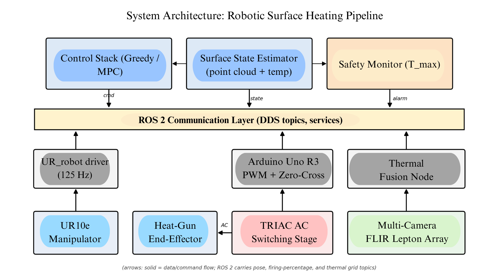

*Fig. 1 — Top-level system architecture. The physical layer (UR10e arm, heat-gun end-effector, TRIAC switching stage, and four-camera FLIR Lepton array) is exposed through low-level drivers to a ROS 2 communication layer. Three high-level nodes close the loop: the surface state estimator fuses thermal images and the registered point cloud into a temperature grid; the control stack (greedy or MPC) emits a heater pose and a firing percentage; and an independent safety monitor tracks the maximum surface temperature and can pre-empt the trajectory.*

The **manipulation stack** is a UR10e 6-DOF arm running the standard `ur_robot_driver` ROS 2 interface. The end-effector is a commercial heat gun mounted through a custom bracket that fixes the nozzle stand-off and orientation relative to the tool flange. The driver accepts streamed Cartesian or joint-space targets at a control rate of 125 Hz.

The **heating-intensity stack** consists of a TRIAC-based AC switching board, a zero-cross detector, an Arduino Uno R3 generating the firing pulse, and an opto-isolation barrier between the low-voltage logic side and the AC mains side. The Arduino exposes a serial topic over which the host commands a target firing percentage in [0, 100]. This becomes the second control input to the closed-loop pipeline alongside the Cartesian heater pose.

The **thermal sensing stack** is a four-camera FLIR Lepton array. The cameras are extrinsically calibrated to the robot base frame using a Perspective-n-Point (PnP) procedure with an in-situ thermal point source (Section VII). At runtime each camera produces a 2D thermal image which is back-projected onto the registered point-cloud representation of the workpiece. A robot-occlusion mask, computed from the known UR10e kinematic chain, is applied per-camera before fusion so that a hot tool body cannot bleed into the surface estimate.

The **control stack** runs at 0.5 Hz for the MPC and at the thermal frame rate for the greedy policy. Both policies emit a heater pose target and a firing percentage at every step, which are forwarded to the manipulation and intensity stacks respectively. A separate safety node monitors the maximum observed surface temperature and pre-empts the trajectory if a configurable hard limit is approached.

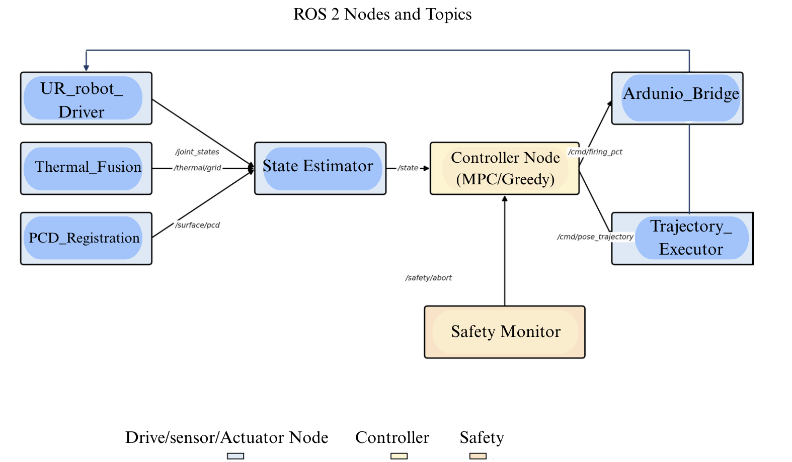

*Fig. 2 — ROS 2 node and topic graph. Sensor and driver nodes (left) publish raw measurements; the State Estimator fuses them into the surface temperature grid that the controller consumes; the controller emits separate command topics for trajectory and firing percentage; and an independent Safety Monitor can pre-empt the controller via `/safety/abort`. The arrow from Trajectory Executor back to UR Robot Driver closes the motion loop through the standard `scaled_joint_trajectory_controller` interface.*

### IV. Hardware Design

**A. UR10e Integration and End-Effector Mounting**

The UR10e is mounted on a fixed base plate, with the workpiece staged within its dexterous workspace. The heat gun is rigidly attached to the tool flange through a custom aluminum bracket that holds the nozzle axis offset from the flange origin so that the heat plume clears the wrist. The bracket is designed to keep the nozzle stand-off constant; this matters for the thermal model, because the moving Gaussian heat-input formulation (Section V) assumes a fixed peak intensity at the surface. Power and trigger leads to the heat gun are routed along the manipulator and strain-relieved at each joint.

**B. TRIAC-Based AC Power Control**

The heat gun draws AC mains power and contains a resistive heating element whose delivered RMS power is the manipulated variable for intensity control. A TRIAC is used as the switching element because it is bidirectional, naturally compatible with AC waveforms, and inexpensive at the current ratings required by a typical heat gun (a few amperes RMS).

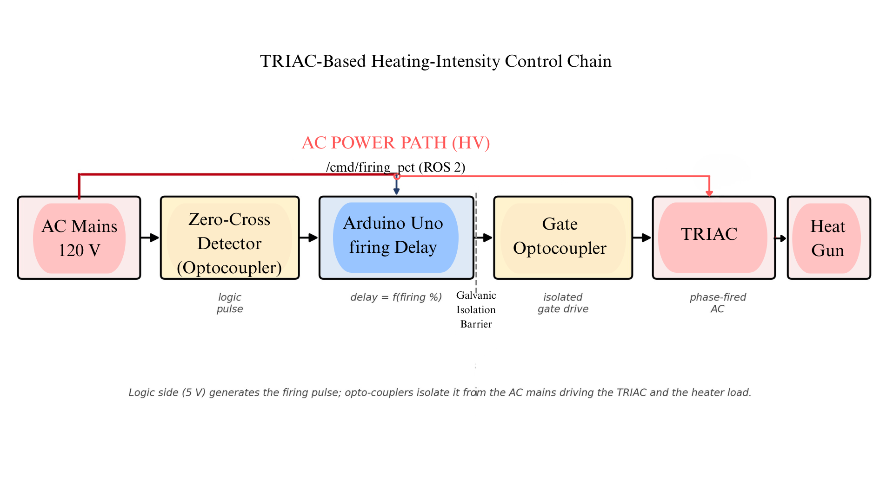

*Fig. 3 — TRIAC-based heating-intensity control chain. The ROS 2 `/cmd/firing_pct` setpoint enters the Arduino, which uses the opto-isolated zero-cross detector to time a firing-delay pulse for each AC half-cycle. That pulse drives the TRIAC gate through a second opto-coupler, sitting across the galvanic isolation barrier that separates the 5 V logic side from the 120 V AC mains path. The TRIAC then conducts the remainder of each half-cycle into the heat-gun load.*

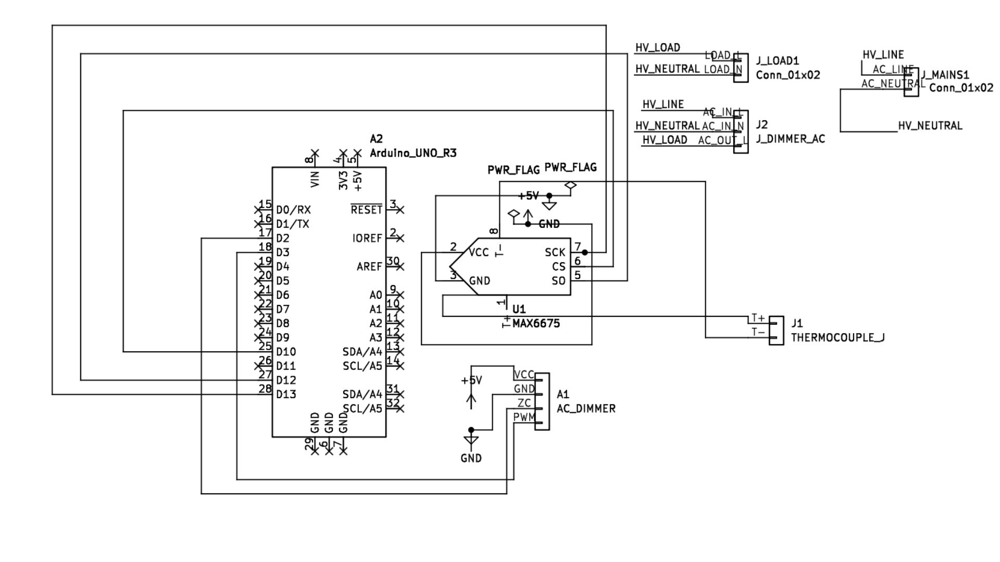

*Fig. 4 — Schematic of the TRIAC firing board. The Arduino Uno R3 drives the AC dimmer module through the zero-cross input and PWM (firing) pins; `J_MAINS` brings in 120 V AC and `J_LOAD` carries phase-fired AC out to the heat gun. A MAX6675 thermocouple amplifier provides an auxiliary in-loop temperature read at the heat-gun outlet for safety cross-checking against the camera-based estimate.*

The TRIAC operates in phase-angle (or, in software, firing percentage) mode. At every AC half-cycle a zero-cross detector emits a logic-level pulse to the Arduino. The Arduino starts a software timer and, after a delay corresponding to the commanded firing percentage, drives the TRIAC gate through the opto-isolator. The TRIAC then conducts for the remainder of that half-cycle. The fraction of each half-cycle in which the TRIAC conducts sets the RMS voltage seen by the heating element, and therefore its delivered power P:

```
P = (V_rms² / R_h) · α(φ)                                          (1)
```

where `R_h` is the heater resistance, `V_rms` is the AC line voltage, and `α(φ) ∈ [0, 1]` is the conduction-fraction function of the firing angle `φ`. Although `α` is nonlinear in `φ`, the software interface exposes the simpler, linear-feeling *firing percentage* (the fraction of the half-cycle for which the gate is enabled), and its nonlinearity is characterized empirically (Section VIII, Fig. 15).

**C. Arduino PWM Firing Generation**

The Arduino performs three jobs in a tight loop: (1) an external interrupt on the zero-cross input pin captures the start of each half-cycle; (2) a hardware timer is reloaded with a delay value derived from the commanded firing percentage; (3) when the timer expires, a short gate pulse is driven onto the TRIAC's gate-driver opto-coupler to fire the device. A free-running PWM signal is *not* used directly on the TRIAC gate, because TRIAC firing must be synchronized to the AC zero-cross to avoid uncontrolled half-cycles and DC imbalance. Instead, the "PWM" nature of the control is in the discrete-time update of the firing-percentage setpoint at the ROS 2 rate.

**D. AC Safety and Galvanic Isolation**

Because the same circuit board carries both 120 V AC mains and 5 V logic from the Arduino, galvanic isolation is required for both safety and signal integrity. Two opto-isolated stages are used. The zero-cross detector is built around an opto-isolated full-bridge so that the logic-side pulse is referenced only to Arduino ground. The TRIAC gate is driven from a dedicated opto-coupler, which provides a high-voltage isolation barrier between the Arduino output pin and the TRIAC gate-cathode loop. Mains-side traces are routed with adequate creepage and clearance, a fuse is placed in the line conductor upstream of the TRIAC, and a snubber RC network is placed across the TRIAC to absorb the inductive component of the heater load and prevent commutation failure. The board is enclosed and the heat-gun cable is connected through an IEC-grade connector.

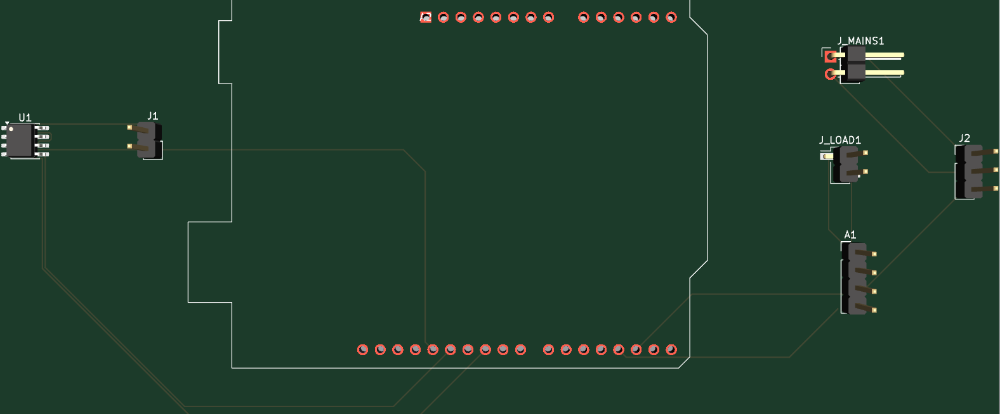

*Fig. 5 — PCB layout of the custom Arduino shield used for the heat-gun control.*

### V. Thermal Modeling

**A. 2D Finite-Difference Diffusion Model**

The relevant region of the workpiece surface is discretized into a 2D grid with a cell size in the range 5–10 mm, chosen to match the resolution of the fused thermal point cloud. Let `T_ij(t)` be the temperature of cell `(i, j)`. The continuous-time dynamics are taken to be a thermal diffusion equation with a forcing term and an environmental loss term:

```
∂T/∂t = ∇·(α∇T) − h(T − T∞) + q(x, t)                              (2)
```

where `α` is the (possibly anisotropic, possibly spatially varying) thermal diffusivity, `h` is a lumped convection coefficient, `T∞` is the ambient temperature, and `q(x, t)` is the volumetric heat input from the heat gun. Discretizing (2) on the surface grid with a standard five-point stencil yields the lumped finite-difference update:

```
Ṫ_ij = Σ_(k,l)∈N(i,j) α_ij,kl·(T_kl − T_ij) − h_ij·(T_ij − T∞) + q_ij(t)   (3)
```

with neighborhood-wise diffusion coefficients `α_ij,kl` and per-cell loss coefficients `h_ij`.

**B. Moving Gaussian Heat Source**

The heat gun is modeled as a moving 2D Gaussian heat source whose center tracks the projected end-effector tip `x_e(t)`:

```
q_ij(t) = h_peak · u(t) · exp( −‖x_ij − x_e(t)‖² / (2σ²) )          (4)
```

where `x_ij` is the world-space position of cell `(i, j)`, `h_peak` is the peak intensity at full firing percentage, `σ` is the spatial spread of the heat plume at the workpiece surface (a function of the fixed nozzle stand-off), and `u(t) ∈ [0, 1]` is the commanded heating intensity. The latter is the link between the actuator and the model: `u(t)` is a smooth, monotone function of the commanded firing percentage that is identified experimentally.

**C. PWM-to-Heat Mapping**

The mapping from commanded firing percentage to the effective `u(t)` in (4) is not the identity, for two reasons. First, the TRIAC's RMS-power-vs-firing-percentage curve is nonlinear (it is approximately sigmoidal, with little change near 0% and 100% and a steep central region). Second, the heat gun itself has internal thermal mass, so its surface effect lags its electrical input. The static portion of this mapping is identified from steady-state experiments (Fig. 15), and the dynamic portion is absorbed into the per-cell parameters `α_ij,kl, h_ij, h_peak, σ` of the learned model.

**D. Model Learning**

The parameters `{α_ij,kl, h_ij, h_peak, σ}` are learned offline from rosbag recordings of exploratory heating runs in which the end-effector follows a deliberately diverse motion pattern over the workpiece. Given a recorded sequence of end-effector poses, firing percentages, and fused thermal-grid measurements, the parameters are optimized in PyTorch using a conjugate-gradient method to minimize the multi-step rollout error of (3)–(4) against the observed temperature trajectories. The resulting learned model is then validated against a GPU-accelerated implicit solver implemented in NVIDIA Warp on the same input sequences; the Warp solver acts as a high-fidelity ground-truth reference for the lumped finite-difference approximation.

### VI. Control Strategies

Both controllers operate on the same state vector — the fused, registered, occlusion-masked surface temperature grid `T(t) ∈ ℝ^(Nx×Ny)` — and emit the same command tuple: a desired Cartesian heater pose and a firing percentage. They differ in how far ahead they look.

**A. Greedy Policy**

The greedy policy is a one-step reactive controller. At every thermal frame, it identifies the cell `(i*, j*)` with the lowest temperature inside the active surface mask, computes the Cartesian pose that points the heater nozzle at `x_i*j*`, and commands a fixed nominal firing percentage. The robot is driven toward the new pose at a bounded Cartesian velocity. This policy is cheap, requires no thermal model, and serves as the natural baseline.

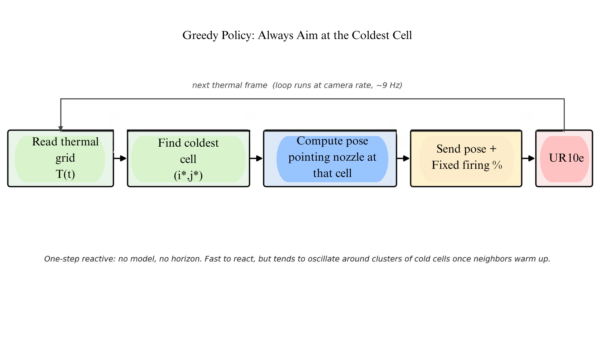

*Fig. 6 — Greedy control loop. At every new thermal frame the controller finds the coldest surface cell, points the heater at it, and commands a fixed firing percentage. There is no internal model and no look-ahead, which makes the controller cheap but prone to oscillation around clusters of cold cells, and to overshooting them once they warm.*

The failure mode of the greedy policy is twofold. First, **hysteresis around clusters of cold cells**: when the heater approaches a cold region, the closest cells warm quickly while neighboring cells remain cold; the controller jitters between them, oscillating the heater and producing localized hot spots without ever fully filling the target band. Second, **overshoot**: because the firing percentage is fixed and the policy has no model of how much longer the heat is needed, cells that have already entered the band are pushed past its upper edge before the controller re-aims.

**B. Continuous-Trajectory MPC**

The MPC plans a full trajectory rather than a one-step move. It is run at 0.5 Hz (replan every 2 s) and looks 4 s ahead. The procedure at each replan step is:

1. Read the current surface temperature grid `T(t_k)`.
2. Generate `K` candidate target cells — the coldest cells in the active mask, subject to a mutual-exclusion radius so that the candidates are spatially distributed.
3. For each candidate, fit a smooth B-spline path from the current end-effector pose to the candidate target.
4. For each candidate path, run a batched rollout of the learned thermal model (3)–(4) on GPU under that path.
5. Score each candidate by the cost:

   ```
   J = J_temp + λ_c · J_curv + λ_l · J_len                         (5)
   ```

   where `J_temp` penalizes deviation of the predicted final temperature field from the target band (and penalizes overshoot), `J_curv` penalizes B-spline curvature, and `J_len` penalizes path length.
6. Select the lowest-cost path. Execute its first 2 s. Replan.

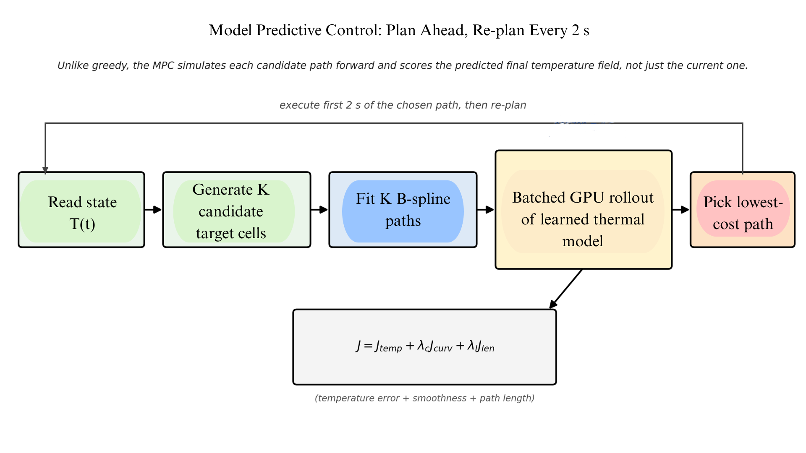

*Fig. 7 — Continuous-trajectory MPC control loop. From the current temperature grid, the controller proposes K candidate target cells (coldest, with mutual-exclusion spacing), fits a smooth B-spline path to each, and rolls each path forward through the learned thermal model on GPU using NVIDIA Warp. The path with the lowest combined cost (temperature error + curvature + length) is selected; only the first 2 s are executed before the controller re-plans.*

The MPC is implemented entirely in NVIDIA Warp so that the `K` candidate rollouts can be batched on a single GPU launch — the critical enabler for real-time replanning at the required horizon, since the underlying thermal dynamics are nonlinear in the trajectory (the Gaussian heat source moves) and a serial rollout of even a modest number of candidate paths would not close the 2 s replan budget.

**C. Static and Dynamic MPC Variants**

Two MPC variants differ only in how the firing percentage is treated during optimization:

- **MPC Static Heat Gun.** The firing percentage is held at a constant nominal value throughout the run. The MPC optimizes only over the trajectory.
- **MPC Dynamic Heat Gun.** The firing percentage enters the optimization as a second control variable (with bounds and rate constraints). The MPC trades trajectory effort against intensity effort within the same cost (5).

This split isolates how much of the closed-loop benefit comes from trajectory planning alone versus from joint trajectory–intensity control.

**D. Why MPC over Greedy**

The MPC's advantage over the greedy policy is structural rather than tuning-dependent. The greedy policy minimizes an instantaneous cost; it has no notion that a slightly warmer cell visited *en route* to a colder one will cool while it is being neglected, nor that a smoothly continuing path may achieve better global uniformity than a sharp re-aim toward the latest local minimum. The MPC, because it scores entire predicted temperature fields against the target band, is biased toward globally uniform heating.

### VII. Experimental Setup

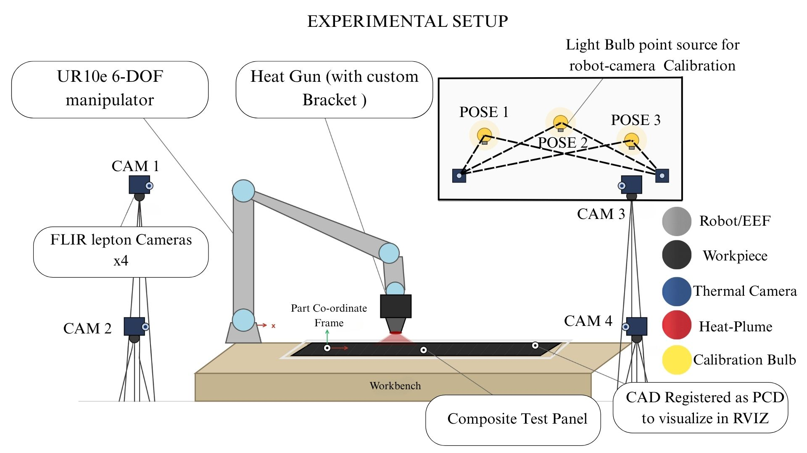

*Fig. 8 — Schematic of the experimental setup. The UR10e holds the heat-gun end-effector over a CAD-registered composite panel staged on a workbench. The part coordinate frame is anchored to fiducial markers on the panel and registered to the robot base by tool-tip touch-off. Four FLIR Lepton thermal cameras are mounted on tripods at the corners of the bench. The inset shows the lightbulb-based hand–eye calibration routine: an incandescent bulb is fixtured to the tool flange and driven through a sequence of known end-effector poses, producing 2D–3D correspondences between bulb pixel centroids in each camera image and the bulb's metric position in the robot base frame.*

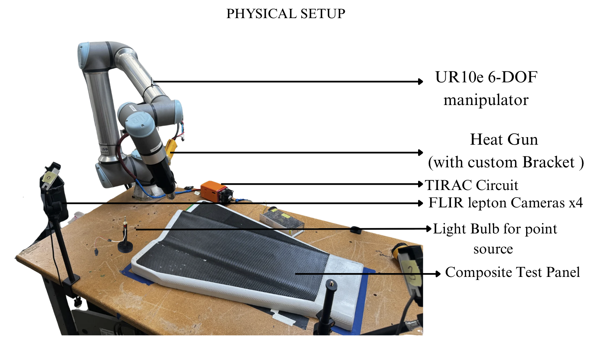

*Fig. 9 — Photograph of the assembled platform. The UR10e (top-left) holds the heat-gun end-effector over the carbon-fiber composite test panel. The orange enclosure on the bench houses the TRIAC firing circuit. The lightbulb point source used for camera calibration is visible standing on the bench, and one of the four FLIR Lepton thermal cameras on its tripod is visible to the left, with the others positioned symmetrically around the panel.*

The full physical setup is illustrated schematically in Fig. 8 and shown as a photograph of the assembled platform in Fig. 9. The UR10e is mounted at one end of a workbench, with the composite test panel taped flat at a known nominal pose within the arm's dexterous workspace. The heat gun is rigidly attached to the tool flange through the custom bracket described in Section IV; the TRIAC switching circuit sits in the orange chassis visible on the bench in Fig. 9. Four FLIR Lepton thermal cameras are mounted on rigid tripods at the corners of the bench, surrounding the panel from approximately symmetric viewpoints. This geometry ensures that at least three cameras observe any given surface cell at any given joint configuration of the manipulator, which is what allows the per-camera robot-occlusion masks to be combined without losing coverage.

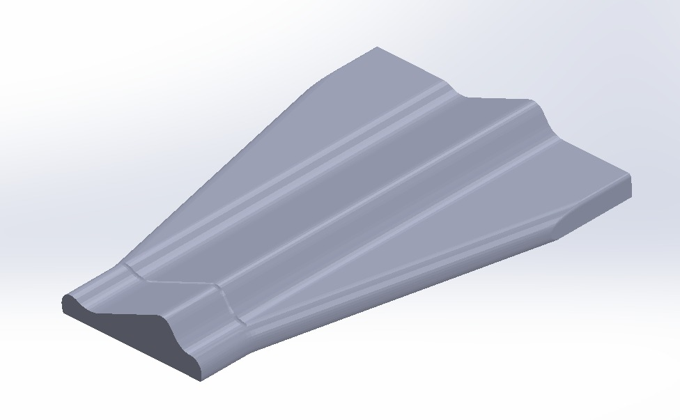

*Fig. 10 — 3D-scanned geometry of the target part used for trajectory planning of the robotic arm-mounted heat gun curing process.*

**A. Part Registration via Tool-Tip Touch-Off**

The composite test panel is registered to the robot base frame `{B}` at the start of every session. Three optically-resolved fiducial markers placed at known offsets on the panel define a part frame `{P}`. To establish the rigid-body transform `T^P_B` between `{P}` and `{B}`, a pointed touch-off probe (Fig. 11) is fixtured to the robot's tool flange. The probe is jogged manually until its tip rests precisely on each fiducial in turn; the corresponding joint configuration is recorded, and forward kinematics yields the 3D position of the probe tip in `{B}`. Pairing those three points with their known coordinates in `{P}` fully determines `T^P_B` via a least-squares Procrustes fit. The CAD mesh of the panel is then transformed into `{B}` and overlaid on the captured RGB-D and thermal point cloud for visual verification in RViz (Fig. 13); the active surface region is discretized at 7 mm cells to produce the grid that the controllers consume as state.

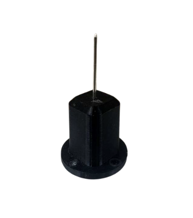

*Fig. 11 — Pointed touch-off probe used for part registration.*

**B. Camera Calibration with a Lightbulb Point Source**

Each thermal camera is calibrated to `{B}` in two stages. Camera intrinsics (focal length, principal point, lens distortion) are obtained beforehand using a standard checkerboard procedure. The extrinsic transform `T^Ci_B` for each camera `i` is then recovered in situ using a thermal point source rather than a printed checkerboard. A small incandescent lightbulb mounted on a 3D-printed stand (Fig. 12) is fixtured to the robot's tool flange in place of the heat gun and driven through a sequence of known end-effector poses spanning the working volume. At each pose the bulb appears as a high-contrast bright blob in every camera, whose centroid is localized in pixel coordinates. Pairing that 2D centroid with the metrically-known 3D position of the bulb in `{B}`, computed from the recorded joint angles via forward kinematics, yields a 2D–3D correspondence. A Perspective-n-Point (PnP) solve over the resulting correspondence set produces `T^Ci_B` for each camera. A hot point source is used deliberately rather than a passive checkerboard because the Lepton's resolution and noise floor make corner detection on a printed target unreliable, whereas the bulb produces a high-SNR, wavelength-appropriate blob that the same thermal pipeline can localize without modification. Because the bulb is rigidly attached to the end-effector and its position in `{B}` therefore follows directly from the robot's forward kinematics, the same routine simultaneously serves as the system's hand–eye calibration.

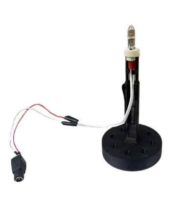

*Fig. 12 — Incandescent lightbulb point source for hand–eye calibration.*

**C. Runtime Sensing and Occlusion Handling**

At runtime, each camera produces a 2D thermal image which is back-projected onto the registered surface point cloud using the calibrated `T^Ci_B`. A per-camera robot-occlusion mask is computed online from the UR10e's URDF and current joint state: the kinematic chain is rasterized into each camera frame and any pixels falling on a robot link (rather than the panel) are excluded from that view's contribution to the fused temperature estimate. This is what prevents the hot tool body from bleeding into the surface state when the heater is mid-sweep.

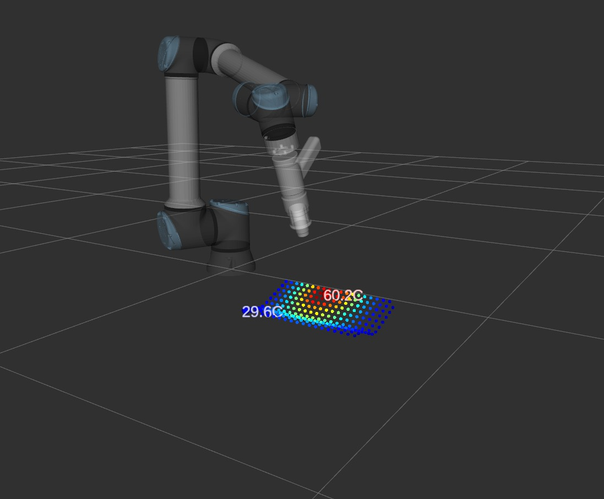

*Fig. 13 — Live RViz visualization of the registered surface grid during a heating run.*

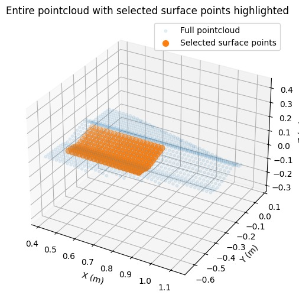

*Fig. 14 — Surface registration output. The light blue cloud is the full captured point cloud of the workspace scene; the dense orange band is the subset of cells selected as the heat-tracked workpiece surface. This mask defines the cells used as the controllers' state and as the basis of the in-band metric reported in Section VIII.*

**D. Run Conditions**

The heating end-effector was a commercial 1500 W heat gun whose mains input passed through the TRIAC firing stage described in Section IV. Firing percentages between 25% and 65% were used in normal operation; below 25% the heat gun blower stalls thermally, and above 65% the surface temperature exceeds the safe range for the composite specimen. The target temperature band was [40, 50] °C, and the initial surface temperature was the laboratory ambient (~22–28 °C across sessions). For each control policy, five repeat trials were performed; reported steady-state curves are the per-trial mean with ±1 inter-trial standard deviation shaded.

### VIII. Results and Discussion

**A. TRIAC Firing-Percentage Characterization**

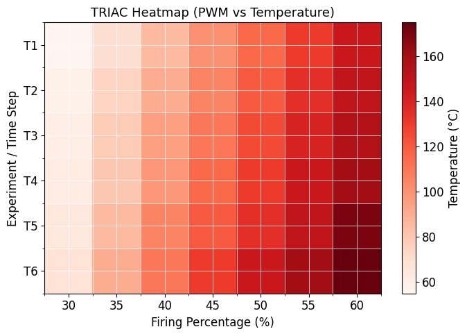

*Fig. 15 — Steady-state surface temperature versus commanded TRIAC firing percentage across six repeat experiments (T1–T6). The mapping is monotonic and approximately repeatable, spanning 55 °C to 170 °C over a 28–63% firing range. The clearly nonlinear shape (steepest in the 45–60% region) is consistent with the analytic α(φ) phase-angle conduction curve in (1) and motivates absorbing the static actuator nonlinearity into the learned thermal model rather than into the low-level firmware.*

Fig. 15 shows the steady-state surface temperature reached by the heat gun as a function of commanded firing percentage, across six repeat experiments. The mapping is monotonic, reasonably repeatable across runs, and spans roughly 55 °C to 170 °C as firing percentage moves from 28% to 63%. Two practical observations follow. First, the response is clearly nonlinear in firing percentage, consistent with the underlying α(φ) nonlinearity in (1); the slope is steepest in the 45–60% region. Second, the spread across the six experiments is small relative to the working range, which justifies treating the firing percentage as a usable continuous control input rather than an actuator that needs per-run recalibration.

**B. Ramp-Up: Greedy vs. MPC Static vs. MPC Dynamic**

The first comparison places the three policies side-by-side during the ramp from ambient into the target band.

**Table I — Average ramp-up time across 5 trials**

| Policy | Ramp-up time to band, mean (SD) |
|---|---|
| Greedy | N/A (overheats above 50 °C) |
| MPC Static Heat Gun | 58.6 s (5.1 s) |
| MPC Dynamic Heat Gun | 85.8 s (7.3 s) |

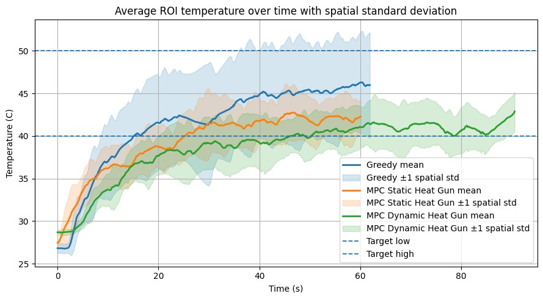

*Fig. 16 — Average ROI temperature during ramp-up for the three policies, with ±1 spatial standard deviation shaded. Greedy (blue) ramps fast but the spatial spread crosses the upper band edge, ending in overheat. MPC Static (orange) settles at the band centre but with a wider spread that still touches 50 °C. MPC Dynamic (green) settles inside the band with the narrowest spread.*

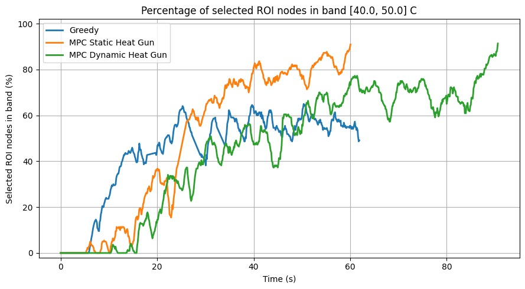

*Fig. 17 — Fraction of selected ROI cells inside the target [40, 50] °C band during ramp-up. Greedy (blue) plateaus around 50–60% and chatters before terminating. MPC Static (orange) climbs past 80% by the end of its 60 s window. MPC Dynamic (green) takes longer to reach the band but is still climbing past 90% at 90 s.*

The **greedy policy** (blue) ramps fastest in the first 30 s but cannot regulate. The mean temperature crosses 40 °C around 18 s, climbs to ~46 °C, and the spatial spread widens to the point where a substantial fraction of cells exceeds 50 °C — the upper band edge. In practice this run terminated as an overheat event, so the greedy ramp-up time is recorded as N/A.

The **MPC Static Heat Gun** policy (orange) ramps more conservatively, takes 58.6 s on average (SD 5.1 s, n = 5) to bring the spatial mean across the lower band edge, and then plateaus near the band centre. Because the firing percentage is held constant, however, the same continuing input that pulled cells into the band keeps pushing them: by the late portion of the ramp, individual cells visited multiple times start to drift past 50 °C, which sets up the steady-state regression reported next.

The **MPC Dynamic Heat Gun** policy (green) ramps slowest, taking 85.8 s on average (SD 7.3 s, n = 5), but the predicted-overshoot term in the cost (5) lets it back off the firing percentage on cells that the model says will continue to coast upward through the band. The mean trace stays inside the band tightly and the spatial spread is the narrowest of the three.

The takeaway from the ramp-up experiments is that ramp-up time is the price paid for the dynamic-heat-gun MPC's ability to regulate without overshoot. For applications where dose-time matters more than time-to-dose, this is precisely the trade-off that should be made.

**C. Steady-State Regulation: Static vs. Dynamic Heat Gun**

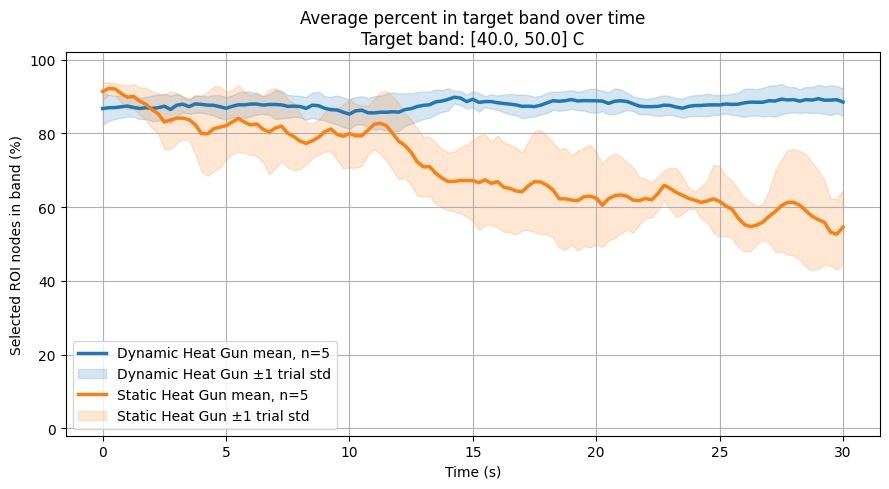

*Fig. 18 — Steady-state in-band fraction averaged across five repeat trials per policy (±1 inter-trial standard deviation shaded). The MPC Dynamic Heat Gun (blue) holds 87–90% of cells in the target band over the full 30 s window with tight inter-trial spread. The MPC Static Heat Gun (orange) starts at the same 90% but decays to ~55% by 30 s as cells drift past the upper band edge under continuing constant power.*

Once each MPC variant has reached the band, the policy is held active and the question becomes how well it *stays* in the band over a 30 s window. The Dynamic policy holds at ~87–90% of cells in-band over the full window, with very tight inter-trial spread. The Static policy starts near 90% and decays monotonically to ~55% by 30 s, with inter-trial spread that grows over time.

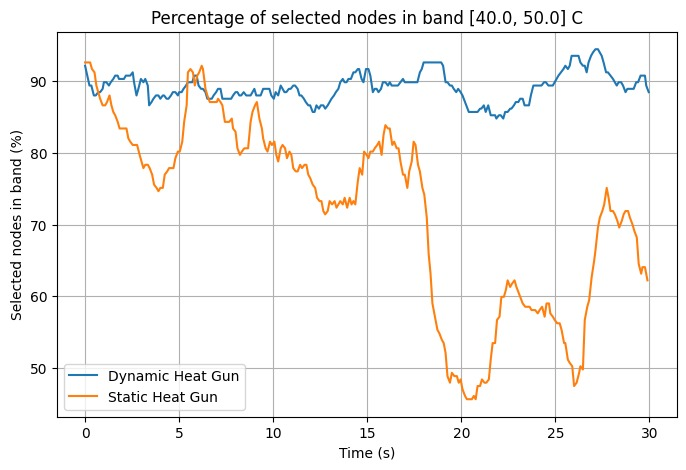

*Fig. 20 — Single-trial in-band fraction over 30 s of steady-state regulation. The Dynamic Heat Gun (blue) stays within ±3 pp of 90% throughout. The Static Heat Gun (orange) drops as low as 45% mid-window before partially recovering, illustrating per-trial what Fig. 18 shows in aggregate.*

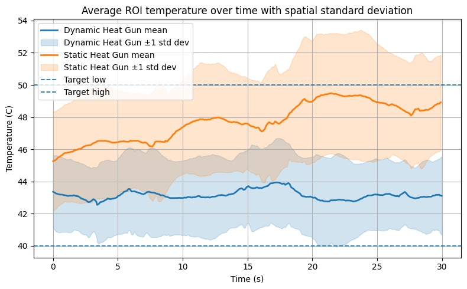

*Fig. 21 — Single-trial spatial-mean ROI temperature over the same 30 s window, with ±1 spatial standard deviation shaded. The Dynamic Heat Gun (blue) holds the mean at ~43 °C and keeps the entire spread inside the band. The Static Heat Gun (orange) drifts to ~49 °C with a spatial spread whose upper edge frequently exceeds 50 °C.*

A representative single-trial pair from the same condition is shown in Fig. 20 and Fig. 21, plotting the per-frame in-band fraction and the spatial-mean temperature respectively. The Dynamic policy holds the spatial mean tightly at ~43 °C with spread that fits inside the band, while the Static policy drifts upward toward 49 °C with spread that frequently crosses the 50 °C boundary.

**D. Dynamic vs. Static Heat Gun Comparison**

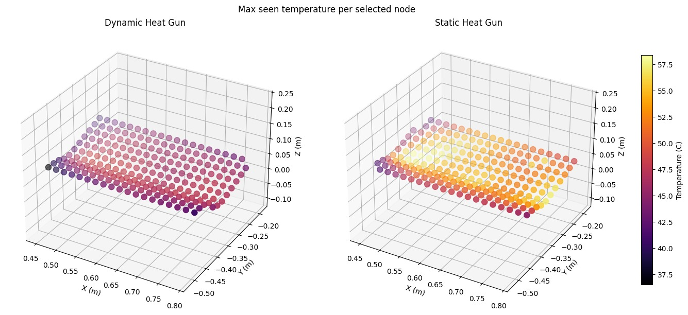

*Fig. 19 — Comparison of peak nodal temperatures across the part surface for the dynamic (robot-guided) and static heat gun cases. The dynamic case yields a more uniform thermal distribution, while the static case produces a localized hot spot directly beneath the heat gun.*

Fig. 19 contrasts the peak nodal temperature field obtained with a dynamic (robot-guided) heat gun against a static heat gun fixed above the workpiece. In the dynamic case, the trajectory generated by the robotic arm distributes thermal input across the entire surface, yielding a smooth, gradient-like temperature map with peak values in the mid-50 °C range and no pronounced localized hotspot. In contrast, the static configuration produces a sharply concentrated hot zone directly beneath the heat-gun nozzle, where peak temperatures exceed 57 °C, while the panel edges remain markedly cooler. This comparison highlights the fundamental motivation for trajectory-based curing: a moving heat source, even under a simple prescribed path, achieves substantially better thermal uniformity than a stationary source of equivalent power. It also establishes a baseline against which both the greedy and MPC controllers can be evaluated — any closed-loop policy must, at minimum, preserve the spatial coverage benefit of motion while additionally regulating the temperature field toward the desired cure profile.

**E. Discussion**

Combining the ramp-up results with the steady-state results yields a clean three-way ordering. The greedy policy ramps fast but cannot regulate; it overshoots by construction because it has no model with which to anticipate that a cell currently in the band will continue to warm. The MPC Static Heat Gun ramps moderately and reaches the band, but its inability to modulate input power means the same input that pulled cells into the band keeps pushing them, and the in-band fraction decays during steady state. The MPC Dynamic Heat Gun ramps slowest — about 27 s slower than Static on average — but holds 87–90% in-band coverage indefinitely with tight inter-trial spread.

The structural argument for joint trajectory–intensity control is therefore borne out experimentally: trajectory-only MPC fixes the spatial pathology of greedy heating, but only joint trajectory–intensity MPC fixes the temporal one.

### IX. Conclusion

We have presented an end-to-end robotic surface-heating platform that closes the loop on both heater motion and heater intensity. A TRIAC-based opto-isolated phase-angle stage, driven by an Arduino on a ROS 2 firing-percentage topic, converts a discrete-time setpoint into a continuous AC heating-power command for a commercial heat gun. Surface temperature is reconstructed by fusing four FLIR Lepton thermal cameras onto a registered workpiece point cloud with explicit robot-occlusion masking; the cameras are calibrated in situ with a lightbulb point source, and the part is registered to the robot base frame via tool-tip touch-off on three fiducials. A learned 2D finite-difference thermal model with a moving Gaussian heat input feeds a continuous-trajectory MPC that optimizes B-spline heater paths in batched GPU rollouts and replans every 2 s.

The TRIAC stage was experimentally characterized as a smooth, monotonic, repeatable mapping from firing percentage to steady-state surface temperature over a useful 55–170 °C range, validating intensity modulation as a continuous control input. Across five repeat trials, the dynamic-heat-gun MPC retained 87–90% of selected cells inside the [40, 50] °C band over a 30 s steady-state window with tight inter-trial spread; the static-heat-gun MPC started at the same 90% but decayed to ~55% as cells drifted out the upper band edge under continuing constant power; and the reactive greedy baseline overshot the band entirely. The dynamic policy paid for its regulation quality with a 27 s slower average ramp-up. These results make the case that joint trajectory–intensity control, not trajectory alone, is the right level at which to close the loop on this class of distributed-parameter heating problem.

### X. Future Work

Several extensions are planned:

1. **Non-planar geometry.** The present experiments were conducted on a planar composite test panel; the surface registration and moving-Gaussian projection are being extended to genuinely non-planar geometries (curved composite skins, weld seams on curved tooling, parts with multiple co-planar regions). The four-camera array was sized with that case in mind, and the registration-by-fiducials procedure generalizes directly. Repeating the static-versus-dynamic comparison across a library of real production parts is a near-term goal on the path to commercialization.
2. **Online model adaptation.** The learned thermal model is currently identified offline from a single exploratory rosbag. An online adaptation step that updates `{α_ij,kl, h_ij}` during operation would let the controller compensate for material and geometry variation across nominally identical parts.
3. **Learned anomaly detection.** Integrating the safety layer with a learned anomaly detector so that unusual thermal trajectories trigger a replan or abort, rather than relying only on hard temperature limits, would harden the system for deployment in real manufacturing cells.
4. **Two-phase ramp/regulate formulation.** The dynamic-heat-gun MPC's slower ramp-up suggests that an explicit two-phase formulation — a more aggressive ramp policy followed by the regulating dynamic MPC once the band is reached — would combine the time-to-dose of the static policy with the dose-time quality of the dynamic policy.

### Acknowledgment

We thank Dr. S. K. Gupta and the USC Center for Advanced Manufacturing for access to the UR10e robotic platform and thermal instrumentation. We also thank Mr. Usiel Ulloa and Mr. Jeffery Vargas for their support.

### References

1. M. H. Rashid, *Power Electronics: Circuits, Devices, and Applications*, 4th ed. Pearson, 2014.
2. S. Macenski, T. Foote, B. Gerkey, C. Lalancette, and W. Woodall, "Robot Operating System 2: Design, architecture, and uses in the wild," *Science Robotics*, vol. 7, no. 66, May 2022.
3. M. Macklin, "Warp: A high-performance Python framework for GPU simulation and graphics," NVIDIA, 2022.
4. J. B. Rawlings, D. Q. Mayne, and M. M. Diehl, *Model Predictive Control: Theory, Computation, and Design*, 2nd ed. Nob Hill Publishing, 2017.
5. F. P. Incropera, D. P. DeWitt, T. L. Bergman, and A. S. Lavine, *Fundamentals of Heat and Mass Transfer*, 7th ed. Wiley, 2011.
6. FLIR Systems, "FLIR Lepton long-wave infrared (LWIR) datasheet," Teledyne FLIR LLC, 2020.
7. Universal Robots, "UR10e technical specifications," Universal Robots A/S, Odense, Denmark, 2023.
8. V. Lepetit, F. Moreno-Noguer, and P. Fua, "EPnP: An accurate O(n) solution to the PnP problem," *International Journal of Computer Vision*, vol. 81, no. 2, pp. 155–166, 2009.
9. L. Biagiotti and C. Melchiorri, *Trajectory Planning for Automatic Machines and Robots*. Springer, 2008.
10. STMicroelectronics, "AN437: Triacs control by microcontrollers," Application Note, 2007.

---

### Summary

- **Heating demo:** cameras observe heat → a 3D thermal cloud is built → the
  planner locates the coldest spot → the arm moves there → the heat gun warms it
  → repeat.
- **Move-only project:** keep `ur_robot_driver`, the UR description, and a MoveIt
  config; drop everything `thermal_*` and `robot_interface`; and write one small
  `move_node.py` that sends a joint or pose goal from any source, including a
  custom model.
