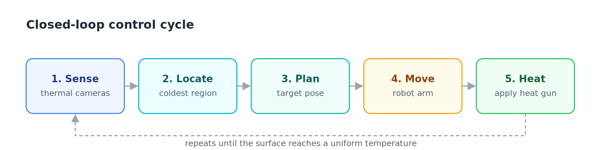
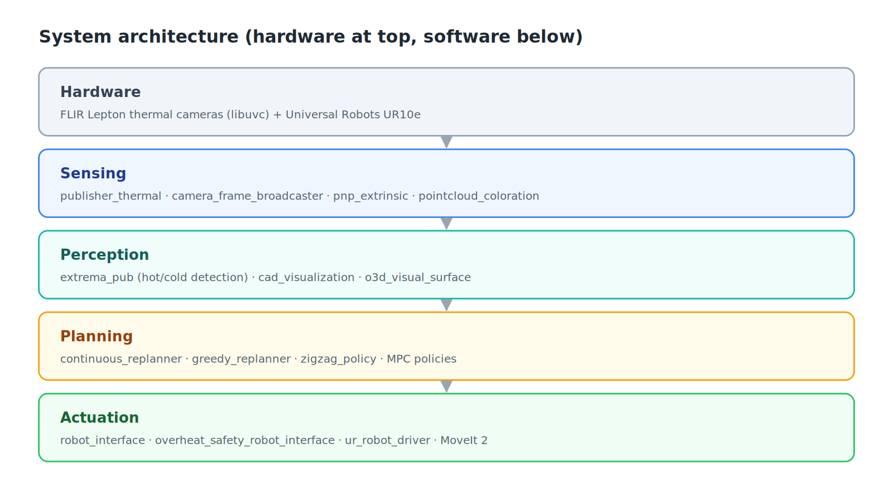
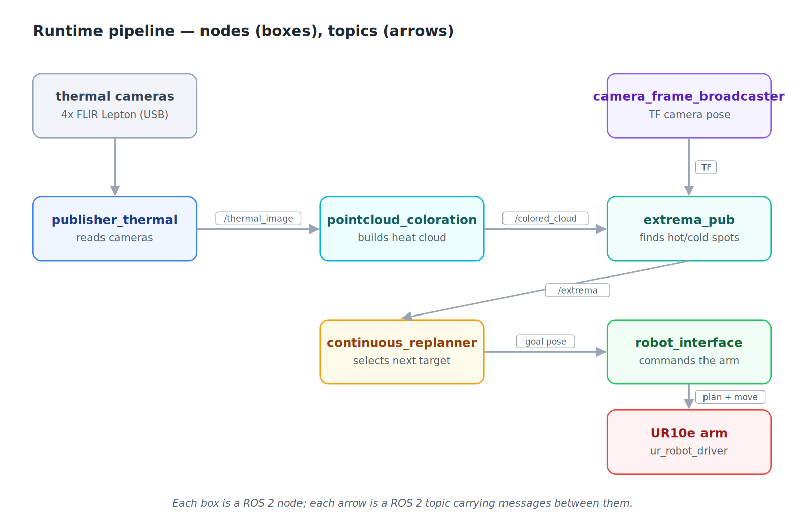
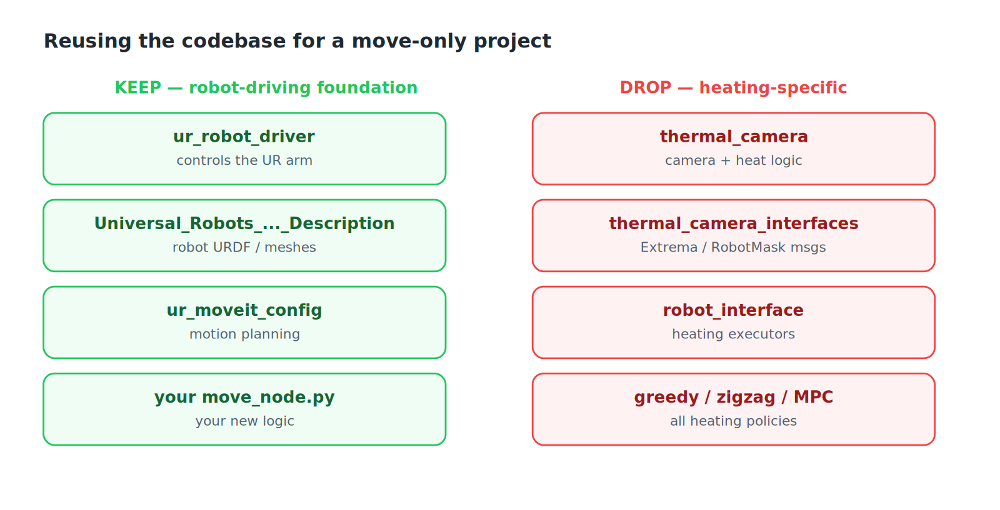
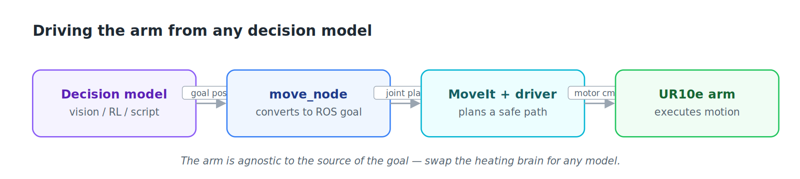

# Robotic Surface Heating

A ROS 2 system for autonomous, closed-loop thermal conditioning of a surface. A
Universal Robots UR10e holds a hot-air tool while an array of FLIR thermal
cameras reconstructs a live 3D temperature field. A planning layer continuously
identifies the coldest region of the target surface and directs the arm to heat
it, repeating until the surface reaches a uniform temperature.

---

## Table of contents

1. [Overview](#1-overview)
2. [What this project achieves](#2-what-this-project-achieves)
3. [ROS 2 concepts used here](#3-ros-2-concepts-used-here)
4. [System architecture](#4-system-architecture)
5. [Runtime pipeline](#5-runtime-pipeline)
6. [Controllers compared: Greedy vs. MPC](#6-controllers-compared-greedy-vs-mpc)
7. [Project structure](#project-structure)
8. [Source files by package (detailed reference)](#7-source-files-by-package-detailed-reference)
9. [Configuration](#8-configuration)
10. [Starting a new "move-only" project](#9-starting-a-new-move-only-project)
11. [Driving the arm from a custom model](#10-driving-the-arm-from-a-custom-model)
12. [Quick start  running the heating demo](#11-quick-start--running-the-heating-demo)
13. [Full research paper](#12-research-paper)
14. [Experiment photos and videos](#13-experiment-photos-and-videos)

---

## 1. Overview

The system runs a single control loop. Thermal cameras observe the surface, the
perception layer locates the coldest region, the planner converts that region
into a target pose, and the arm moves there and applies heat. As each cold spot
warms, a new coldest region appears, and the loop continues until the surface is
evenly heated.



---

## 2. What this project achieves

This work automates a process that is normally manual: bringing a surface to a
uniform target temperature with a robot-mounted heat gun. The contribution is
that **both the trajectory and the heating intensity are controlled together** —
prior automated approaches move the tool but leave intensity fixed.

**System built**

- A **TRIAC-based intensity stage** (custom PCB) that modulates the 1500 W heat
  gun via phase-angle firing, giving continuous, repeatable control of delivered
  power. Open-loop characterization is monotonic and repeatable across the firing
  range.
- A **multi-camera FLIR Lepton thermal pipeline** that fuses several thermal
  views into a single live 3D temperature field, with URDF-based occlusion
  masking so the arm itself is removed from the reconstruction.
- A **physics-based thermal model** (2D finite-difference heat diffusion with a
  moving Gaussian source) fit offline in PyTorch and validated against an
  NVIDIA Warp solver. The model lets the planner predict how heat will spread.
- A **closed-loop planning layer** that re-plans continuously and drives the arm
  toward whichever region is coldest or out of band.

**Headline result**

A head-to-head experiment compared three controllers on a planar composite panel
(10 mm analysis grid, 40–50 °C target band, firing clamped to 25–65 %, five
trials per policy). The adaptive controller (**MPC Dynamic**) holds **87–90 % of
the surface inside the target band at steady state, versus ~55 % for the
static baseline** — roughly a 1.6× improvement in uniform coverage.

---

## 3. ROS 2 concepts used here

The software is organized as a set of independent processes called **nodes**.
Nodes do not call each other directly; they exchange data over named channels.

- **Publisher** — a node that writes messages to a topic.
- **Subscriber** — a node that reads messages from a topic.
- **Topic** — a named, typed message channel (for example `/coldest_pose`). Any
  node may publish or subscribe to it.
- **Service** — a request/response call: a node sends a request and blocks until
  it receives a reply.
- **TF tree** — the live coordinate-frame graph describing where every link of
  the robot and every camera sits in space.

---

## 4. System architecture

The stack is layered from the physical hardware down to the software that drives
it. Each layer depends only on the one above it.



---

## 5. Runtime pipeline

The diagram below shows the nodes that run during a live demo and the topics
that connect them.



### Key topics

| Topic | Payload | Publisher | Subscriber |
|---|---|---|---|
| `/thermal_camera_*/image_raw` | Raw thermal images | Camera publisher | Point-cloud coloration |
| `/raw_thermal_pointcloud` | 3D points with temperature | Point-cloud coloration | Brain, surface picker |
| `/colored_cad_pointcloud` | Colored cloud for RViz | Point-cloud coloration | RViz |
| `robot_mask` | Pixels belonging to the arm | `robot_mask_pub` | Point-cloud coloration |
| `/selected_surface_points` | The selected target surface | Surface picker | Brain, data collectors |
| `/coldest_pose`, `/hottest_pose` | Extremum pose + temperature | Brain | Robot interface |
| `/robot_target_pose` | Target pose for the arm | Brain | Robot interface |
| `/joint_states` | Current joint angles | Robot driver | Mask, coloration |

### Custom messages

- **`Extrema`** — header, a list of poses, and a scalar `value` (temperature).
  Used to communicate cold/hot spots.
- **`RobotMask`** — header plus camera images marking where the robot occupies
  the frame.
- **`PoseToPlan`** (service) — accepts a position and orientation, returns
  `success: true/false`.

---

## 6. Controllers compared: Greedy vs. MPC

The planning layer is the part that decides *where to heat next*, and the project
evaluated three strategies. They differ in whether they use a thermal model and
whether they reason about the future.

### The three policies

| Policy | Uses a model? | Plans ahead? | Intensity | File |
|---|---|---|---|---|
| **Greedy** | No | No | Fixed firing % | `greedy_replanner.py` |
| **MPC Static** | Yes | Yes (4 s horizon) | One fixed % per plan | `mpc_test_1.py` / `extrema_pub_modular.py` |
| **MPC Dynamic** | Yes | Yes (4 s horizon) | Varies along the path | `continuous_replanner.py` |

### How Greedy works

Find the coldest cell in the fused grid, point the heat gun at it, fire at a
fixed percentage, repeat. No model, no horizon, no temporal reasoning. Two
failure modes follow directly:

- **Oscillation (spatial pathology).** Once the coldest cell warms, a neighbor
  becomes coldest, so the arm jumps back and forth across a cluster of cold
  cells, never letting any of them stabilize.
- **Overshoot (temporal pathology).** A fixed firing percentage with no temporal
  authority means cells the arm dwells over blow past the target band.

### How MPC works

Re-plan every 2 seconds over a 4-second horizon:

1. Read the fused thermal grid.
2. Sample *K* candidate target cells (cold or out of band).
3. Fit *K* B-spline paths from the current end-effector pose to each target.
4. Roll out every candidate forward 4 s under the learned thermal model
   (batched GPU rollout).
5. Score each with the cost function below.
6. Execute the first 2 s of the winning plan, then re-plan.

The cost function balances getting on-temperature against smooth, short paths:

```
J = J_temp + λ_c · J_curv + λ_l · J_len
```

**MPC Static** uses one fixed firing percentage per plan. **MPC Dynamic** lets
the firing percentage vary along the trajectory, which is what gives it temporal
authority over each cell.

### Results

| Policy | Time to band | Steady-state in-band coverage |
|---|---|---|
| Greedy | — (overshoots, never stabilizes) | low / unstable |
| MPC Static | **58.6 s** (SD 5.1 s) | ~55 % |
| MPC Dynamic | 85.8 s (SD 7.3 s) | **87–90 %** |

The apparent paradox is the point: **MPC Static reaches the band *faster*, but
MPC Dynamic *stays* in band**. Time-to-band is only half the story — Static
enters quickly but then drifts out (temporal pathology), while Dynamic, by
varying intensity along the path, solves both the oscillation (spatial) and the
drift (temporal) problems. Jointly optimizing trajectory *and* intensity is what
delivers uniform coverage.

---

## Project structure

A map of every Python file, grouped by package. Legend: **● live · ○ experimental / legacy · ◆ shared helper.**

```text
robot_surface_heating/
└── src/
    ├── thermal_camera/                    # sensing, perception, planning (core)
    │   ├── config/
    │   │   ├── camera_params.yaml
    │   │   ├── pnp_calibration_config.yaml
    │   │   ├── cad_register_config.yaml
    │   │   └── pcl_params.yaml
    │   └── thermal_camera/
    │       │  # --- camera acquisition ---
    │       ├── ● publisher_thermal.py             # reads FLIR cameras, publishes thermal images
    │       ├── ◆ uvctypes.py                      # libuvc Python bindings
    │       ├── ● uvc_visualize.py                 # live 2D thermal viewer (per camera)
    │       ├── ○ uvc-radiometry_2.py              # older single-camera viewer
    │       ├── ○ realsense_calib_test.py          # RealSense depth test (off main path)
    │       │  # --- calibration & frames ---
    │       ├── ● camera_frame_broadcaster.py      # publishes camera poses to TF
    │       ├── ● pnp_extrinsic.py                 # extrinsic calibration (click correspondences)
    │       ├── ○ extrinsic.py                     # alternate extrinsic calibration
    │       ├── ○ thermal-intrinsic-calibration.py # per-camera intrinsic calibration
    │       ├── ● bundle_adjustment.py             # joint refinement of all camera poses
    │       ├── ◆ transform_formatting.py          # transform formatting helper
    │       │  # --- 3D thermal reconstruction ---
    │       ├── ● pointcloud_coloration.py         # projects thermal pixels to 3D (multi-cam)
    │       ├── ○ pointcloud_coloration_single.py  # single-camera variant
    │       ├── ○ thermal_pointcloud.py            # early prototype
    │       ├── ● robot_mask_pub.py                # masks arm pixels from coloration
    │       ├── ● virtual_camera_viewer.py         # virtual arm view from joint angles
    │       ├── ○ mask_playback.py                 # replays saved masks
    │       ├── ● realtime_masked_visualizer.py    # live masked thermal grid
    │       │  # --- CAD model ---
    │       ├── ● cad_visualization.py             # loads CAD/STL, displays in RViz
    │       ├── ◆ cad_registration.py              # registers CAD to live cloud
    │       ├── ● stl_to_lattice.py                # STL surface -> targetable point grid
    │       ├── ○ stl_to_lattice_old1.py           # older version
    │       ├── ○ txt_to_lattice.py                # lattice from text dump (experimental)
    │       ├── ○ txt_processing.py                # text model processing (experimental)
    │       │  # --- planning: extremum detection & policies ---
    │       ├── ● extrema_pub.py                    # primary planner -> /robot_target_pose
    │       ├── ● extrema_pub_modular.py           # configurable planner + coverage metric
    │       ├── ○ extrema_pub_curobo.py            # cuRobo GPU-planner variant
    │       ├── ○ coldest_pose_pub.py              # older standalone coldest-spot publisher
    │       ├── ● hottest_temp_pub.py              # publishes hottest temperature value
    │       ├── ● greedy_replanner.py              # greedy policy (nearest cold spot)
    │       ├── ● continuous_replanner.py          # adaptive re-planning policy
    │       ├── ○ continuous_replanner_old*.py     # 6 legacy versions
    │       ├── ● zigzag_policy.py                 # zig-zag sweep policy
    │       ├── ● optimize_single_real.py          # single-step optimizer (learned model)
    │       ├── ○ optimize_single_real_old6.py     # older version
    │       ├── ● mpc_test_1.py                    # model-predictive-control experiment
    │       ├── ◆ single_horizon.py                # single-step math for MPC/optimizer
    │       ├── ◆ adhesive_single.py               # material/heat-transfer helper
    │       ├── ◆ learned_model_util.py            # loads learned thermal model
    │       ├── ● thermal_model_reader.py          # trains/uses the thermal model
    │       │  # --- surface selection & paths ---
    │       ├── ● o3d_visual_surface.py            # interactive surface picker
    │       ├── ○ o3d_visual_surface_old1.py       # older picker
    │       ├── ○ o3d_visual_surface_old2.py       # older picker
    │       ├── ● heater_path_to_cartesian.py      # heating path -> 3D waypoints
    │       ├── ● heating_path_data_collection.py  # builds/serves heating path (services)
    │       ├── ◆ common_motionplan_utilities.py   # shared motion math (normals, offsets)
    │       ├── ● debug_surface_normals.py         # surface-normal debug overlay
    │       │  # --- heat-gun control ---
    │       ├── ● heat_gun_controller.py           # sets heat-gun power via Arduino (serial)
    │       ├── ● heater_manual.py                 # manual terminal heat-gun control
    │       ├── ○ arduino_dummy.py                 # mock Arduino for testing
    │       │  # --- recording & replay ---
    │       ├── ● thermal_data_collector.py        # records cloud + poses to rosbag
    │       ├── ● rosbag_reader.py                 # rosbag -> .npz dataset
    │       ├── ○ traj_rosbag_reader.py            # rosbag -> dataset + trajectories
    │       ├── ● thermal_rerun.py                 # streams recorded data to Rerun viewer
    │       ├── ● live_temp_plotter.py             # live surface-temperature plot
    │       ├── ○ temp_data_analysis.py            # one-off .npz plotting
    │       ├── ○ timestamp_comparator.py          # checks camera timestamp alignment
    │       ├── ◆ read_write_pkl.py                # pickle read/write helper
    │       └── ○ pyrender_urdf_test.py            # URDF rendering test
    │
    ├── robot_interface/                    # arm execution
    │   └── robot_interface/
    │       ├── ● overheat_safety_robot_interface.py # primary executor (MoveIt + safety)
    │       ├── ● demo_robot_interface.py          # executor for the RSS demo
    │       ├── ● modular_executor.py              # configurable executor (debug topics)
    │       ├── ● dual_robot_interface.py          # controls two arms
    │       ├── ● heater_path_executor.py          # executes a full heating path
    │       ├── ● lightweight_executor.py          # minimal executor — START HERE for custom nodes
    │       ├── ● lightweight_executor_heat_gun.py # minimal executor + heat gun
    │       ├── ○ lightweight_executor_old.py      # older version
    │       ├── ◆ moveit_waitable.py               # awaits MoveIt async results
    │       ├── ◆ curobo_planner.py                # optional cuRobo (GPU) planner wrapper
    │       ├── ○ moveit_test.py                   # MoveIt Cartesian-planning demo
    │       ├── ● live_temp_plotter.py             # live temperature plot
    │       ├── ○ async_node.py                    # minimal example node
    │       ├── ○ execute.py                       # example PoseToPlan client
    │       ├── ○ dump.py                          # scratch/dev interface
    │       ├── ○ gripper_test_node.py             # gripper test
    │       ├── ○ test_robot_interface.py          # test executor
    │       ├── ○ test_robot_interface_new.py      # test executor
    │       ├── ○ rin_boilerplate_code.py          # starter template
    │       └── ○ toy_executor_stub.py             # mock executor (no real robot)
    │
    ├── thermal_camera_interfaces/          # message definitions only
    │   └── msg/
    │       ├── Extrema.msg
    │       └── RobotMask.msg
    │
    ├── lerobot_interface/                  # optional LeRobot bridge
    │   └── lerobot_interface/
    │       └── ○ robot_control_node.py            # bridge to a LeRobot-style arm
    │
    ├── fake_gripper_publisher/             # simulated gripper
    │   └── fake_gripper_publisher/
    │       └── ○ fake_joint_state_publisher.py    # fake gripper joint states for sim
    │
    └── (vendored, off-the-shelf — mostly launch/setup files)
        ├── ur_robot_driver/                       # UR ROS 2 driver
        ├── Universal_Robots_ROS2_Description/     # robot URDF + meshes
        └── thermal_moveit_config/                 # MoveIt config for this cell
```

## 7. Source files by package (detailed reference)

Legend: **● live system · ○ experimental / legacy (safe to ignore while
learning) · ◆ shared helper imported by other files.**

### `thermal_camera` — sensing, perception, and planning (core)

**Camera acquisition**

| File | Description |
|---|---|
| ● `publisher_thermal.py` | Reads the FLIR thermal cameras and publishes thermal images. |
| ◆ `uvctypes.py` | Python bindings to the camera USB library (`libuvc`). |
| ● `uvc_visualize.py` | Live 2D thermal viewer windows, one per camera. |
| ○ `uvc-radiometry_2.py` | Older single-camera viewer experiment. |
| ○ `realsense_calib_test.py` | RealSense depth-camera test (not on the main path). |

**Camera calibration and frames**

| File | Description |
|---|---|
| ● `camera_frame_broadcaster.py` | Publishes each camera's pose to TF. |
| ● `pnp_extrinsic.py` | Extrinsic calibration: click corresponding points to recover each camera's pose. |
| ○ `extrinsic.py` | Alternate/older extrinsic calibration. |
| ○ `thermal-intrinsic-calibration.py` | Per-camera intrinsic (lens) calibration. |
| ● `bundle_adjustment.py` | Joint refinement of all camera poses for higher accuracy. |
| ◆ `transform_formatting.py` | Transform formatting/cleanup helper. |

**3D thermal reconstruction**

| File | Description |
|---|---|
| ● `pointcloud_coloration.py` | Projects thermal pixels onto 3D points (multi-camera). |
| ○ `pointcloud_coloration_single.py` | Single-camera variant. |
| ○ `thermal_pointcloud.py` | Early prototype of the thermal cloud. |
| ● `robot_mask_pub.py` | Identifies arm pixels so they are excluded from coloration. |
| ● `virtual_camera_viewer.py` | Renders a virtual camera view of the arm from joint angles (used for masking). |
| ○ `mask_playback.py` | Replays saved masks for testing. |
| ● `realtime_masked_visualizer.py` | Live view of the masked thermal grid. |

**CAD model**

| File | Description |
|---|---|
| ● `cad_visualization.py` | Loads the part's CAD/STL model and displays it in RViz. STL path is set here. |
| ◆ `cad_registration.py` | Registers the CAD model against the live point cloud. |
| ● `stl_to_lattice.py` | Converts an STL surface into a grid of targetable points. |
| ○ `stl_to_lattice_old1.py` | Older version of the above. |
| ○ `txt_to_lattice.py` / `txt_processing.py` | Build/process lattices from text model dumps (experimental). |

**Planning — extremum detection and policies**

| File | Description |
|---|---|
| ● `extrema_pub.py` | Primary planner: locates the coldest and hottest spots, publishes `/robot_target_pose`. |
| ● `extrema_pub_modular.py` | Configurable planner that also publishes greedy targets and in-band coverage. |
| ○ `extrema_pub_curobo.py` | Planner variant using the cuRobo GPU planner. |
| ○ `coldest_pose_pub.py` | Older standalone coldest-spot publisher. |
| ● `hottest_temp_pub.py` | Publishes the single hottest temperature value. |
| ● `greedy_replanner.py` | Greedy policy: always heat the nearest cold spot next. |
| ● `continuous_replanner.py` | Adaptive policy: re-plans the path as the surface heats. |
| ○ `continuous_replanner_old*.py` | Six legacy versions of the continuous policy. |
| ● `zigzag_policy.py` | Sweeps the tool over the surface in a zig-zag pattern. |
| ● `optimize_single_real.py` | Optimizes a single heating step using a learned thermal model. |
| ○ `optimize_single_real_old6.py` | Older version of the above. |
| ● `mpc_test_1.py` | Model-predictive-control heating experiment. |
| ◆ `single_horizon.py` | Single-step math helper for the MPC/optimizer. |
| ◆ `adhesive_single.py` | Material/heat-transfer helper for the planners. |
| ◆ `learned_model_util.py` | Loads the learned thermal (heat-diffusion) model. |
| ● `thermal_model_reader.py` | Reads recorded data and trains/uses the thermal model. |

**Surface selection and paths**

| File | Description |
|---|---|
| ● `o3d_visual_surface.py` | Interactive picker for selecting the surface to heat. |
| ○ `o3d_visual_surface_old1.py` / `_old2.py` | Older versions of the picker. |
| ● `heater_path_to_cartesian.py` | Converts a heating path into 3D robot waypoints. |
| ● `heating_path_data_collection.py` | Builds/serves a heating path; offers `/select_heating_path` and `/publish_heating_path` services. |
| ◆ `common_motionplan_utilities.py` | Shared motion math (e.g. tool offset along surface normals). |
| ● `debug_surface_normals.py` | Debug overlay of surface-normal arrows. |

**Heat-gun control**

| File | Description |
|---|---|
| ● `heat_gun_controller.py` | Sets heat-gun power via the Arduino over serial, based on heat metrics. |
| ● `heater_manual.py` | Manual terminal control of the heat gun. |
| ○ `arduino_dummy.py` | Mock Arduino for hardware-free testing. |

**Data recording and replay**

| File | Description |
|---|---|
| ● `thermal_data_collector.py` | Records the live cloud and robot poses to a rosbag. |
| ● `rosbag_reader.py` | Reads a rosbag and exports it as an `.npz` dataset. |
| ○ `traj_rosbag_reader.py` | As above, also saving trajectory/joint data. |
| ● `thermal_rerun.py` | Streams recorded data into the Rerun 3D viewer. |
| ● `live_temp_plotter.py` | Live temperature plot for the selected surface. |
| ○ `temp_data_analysis.py` | One-off `.npz` plotting script. |
| ○ `timestamp_comparator.py` | Checks camera timestamp alignment. |
| ◆ `read_write_pkl.py` | Small pickle read/write helper for debugging. |
| ○ `pyrender_urdf_test.py` | URDF rendering test with pyrender. |

### `robot_interface` — arm execution

| File | Description |
|---|---|
| ● `overheat_safety_robot_interface.py` | Primary executor: subscribes to `/robot_target_pose`, plans with MoveIt, moves the arm with safety checks. |
| ● `demo_robot_interface.py` | Executor used in the full RSS demo. |
| ● `modular_executor.py` | Configurable executor wired to debug topics and the heating path. |
| ● `dual_robot_interface.py` | Controls two arms simultaneously. |
| ● `heater_path_executor.py` | Executes a full heating path with the heat gun. |
| ● `lightweight_executor.py` | Minimal, fast executor. **Best reference when writing a custom move node.** |
| ● `lightweight_executor_heat_gun.py` | Minimal executor that also toggles the heat gun. |
| ○ `lightweight_executor_old.py` | Older version. |
| ◆ `moveit_waitable.py` | Helper for awaiting MoveIt async results. |
| ◆ `curobo_planner.py` | Optional cuRobo (GPU) motion-planner wrapper. |
| ○ `moveit_test.py` | MoveIt Cartesian-planning demo. |
| ● `live_temp_plotter.py` | Live temperature plot, runnable from this package. |
| ○ `async_node.py` | Minimal example node subscribing to `debug_cold_pose`. |
| ○ `execute.py` | Example client for the `PoseToPlan` service. |
| ○ `dump.py` | Scratch/dev version of the robot interface. |
| ○ `gripper_test_node.py` | Gripper test. |
| ○ `test_robot_interface.py` / `_new.py` | Test executors that publish `/robot_target_pose`. |
| ○ `rin_boilerplate_code.py` | Starter template. |
| ○ `toy_executor_stub.py` | Mock executor (no real robot). |

### `thermal_camera_interfaces` — message definitions

Message definitions only (`Extrema.msg`, `RobotMask.msg`). No runtime logic;
`__init__.py` is empty.

### `lerobot_interface` — optional LeRobot bridge

| File | Description |
|---|---|
| ○ `robot_control_node.py` | Bridge to a LeRobot-style arm. Optional, not part of the heating demo. |
| | `test_copyright/flake8/pep257.py` are auto-generated lint tests. |

### `fake_gripper_publisher` — simulated gripper

| File | Description |
|---|---|
| ○ `fake_joint_state_publisher.py` | Publishes fake gripper joint states so the robot model is complete in simulation. |

### Vendored packages

`ur_robot_driver`, `Universal_Robots_ROS2_Description`, and
`thermal_moveit_config` are standard, off-the-shelf Universal Robots / MoveIt
packages. Their Python files are mostly launch and setup scripts that start the
driver, load the robot URDF, and configure MoveIt. **Do not remove the
description package** — the arm requires it to know its own geometry.

---

## 8. Configuration

Most behavior is configurable without code changes. In
`src/thermal_camera/config/`:

| File | Settings |
|---|---|
| `camera_params.yaml` | `camera_count` and `extrinsics_prefix` (which calibration to load). |
| `pnp_calibration_config.yaml` | `camera_count` and the output path for new calibrations. |
| `cad_register_config.yaml` | CAD registration settings. |
| `pcl_params.yaml` | Point-cloud filtering settings. |

In `cad_visualization.py`, the line `STL_FILE_PATH = ".../RSS_v3.stl"` selects
which part's CAD model is loaded.

---

## 9. Starting a new "move-only" project

To build a clean project that only moves the UR arm — without any thermal or
heating code — keep the robot-driving foundation and remove the rest. Motion
control itself is provided off the shelf by the Universal Robots ROS 2 driver
and MoveIt; you do not write a driver. The heating code sits entirely on top of
that foundation.



### Keep — the robot-driving foundation

| Package | Role | Why keep |
|---|---|---|
| `ur_robot_driver` | Connects ROS to the UR10e and exposes its controllers. | This is the driver. |
| `Universal_Robots_ROS2_Description` | Robot URDF and meshes (geometry, joints, limits). | The arm needs its own model. |
| `thermal_moveit_config` *(optional, rename)* | MoveIt config for this cell. | Keep for ready-made motion planning; rename to drop "thermal". |

### Drop — heating-specific packages

`thermal_camera`, `thermal_camera_interfaces`, `lerobot_interface`,
`fake_gripper_publisher`, **and `robot_interface`**.

> **Do not reuse `robot_interface` as-is.** Its executors (e.g.
> `overheat_safety_robot_interface.py`) import `thermal_camera_interfaces` and
> `common_motionplan_utilities`, so they will not build once the thermal
> packages are removed. Use them only as a reference for how to call MoveIt, then
> write a clean node of your own.

### Recommended workspace layout

```
my_new_robot_ws/
└── src/
    ├── ur_robot_driver/                       # the driver
    ├── Universal_Robots_ROS2_Description/     # robot body (URDF/meshes)
    ├── thermal_moveit_config/  (renamed)      # motion planning (optional)
    └── my_robot_task/                         # your new code
        ├── package.xml
        ├── setup.py
        └── my_robot_task/
            └── move_node.py                   # decides where to move
```

### Moving the arm in three steps

**1. Bring up the robot:**

```bash
ros2 launch ur_robot_driver ur10e.launch.py robot_ip:=<ROBOT_IP>
ros2 launch ur_moveit_config ur_moveit.launch.py        # only if you want planning
```

**2. Send goals from `move_node.py`.** Choose one of two styles:

- **Direct (no planning):** publish a `JointTrajectory` to
  `/scaled_joint_trajectory_controller/joint_trajectory` (or use the
  `FollowJointTrajectory` action) to drive the joints to chosen angles. Simplest
  starting point.
- **Collision-aware:** call MoveIt's `GetCartesianPath` service or the
  `MoveGroup` action with a target **pose**, then execute the returned
  trajectory. `lightweight_executor.py` demonstrates this MoveIt call pattern —
  reuse the structure but remove the `thermal_camera_interfaces` / `Extrema`
  imports.

**3. Build and run:**

```bash
colcon build --symlink-install
source install/setup.bash
ros2 run my_robot_task move_node
```

### Using a different arm

Replace `ur_robot_driver` and `Universal_Robots_ROS2_Description` with your
robot's ROS 2 driver and description package, and use that vendor's MoveIt
config. The `move_node.py` pattern is unchanged; only the controller and topic
names differ.

---

## 10. Driving the arm from a custom model

Any decision-maker can drive the arm — the heating planner is just one option.
A vision model, a reinforcement-learning policy, or a plain script can all
produce goals; the arm is agnostic to their source.



The model outputs a target (a pose or a set of joint angles). `move_node.py`
receives it, hands it to MoveIt and the driver, and the arm executes a safe
path. That is the entire integration.

---

## 11. Quick start — running the heating demo

Run each command in its own terminal from `robot_surface_heating/`, after
`source install/setup.bash`:

```bash
ros2 launch ur_robot_driver thermal_ur_control.launch.py    # 1. robot driver
ros2 launch thermal_moveit_config thermal_moveit.launch.py  # 2. MoveIt
ros2 launch thermal_camera cams_and_cad.launch.py           # 3. cameras + CAD
ros2 launch thermal_camera pcl_analysis.launch.py           # 4. surface selection
ros2 launch thermal_camera policy_launch.launch.py          # 5. planning policy
ros2 run robot_interface overheat_safety_robot_interface.py # 6. arm execution
```

In RViz, add a **PointCloud2** display on `/selected_surface_points` and set its
reliability to *Best Effort*.

---

## 12. Research paper

This project is written up as a paper. The source PDF is checked into the repo
at [`paper/Adaptive_Robotic_Surface_Heating.pdf`](paper/Adaptive_Robotic_Surface_Heating.pdf)


### Summary

- **Heating demo:** cameras observe heat → a 3D thermal cloud is built → the
  planner locates the coldest spot → the arm moves there → the heat gun warms it
  → repeat.
- **Move-only project:** keep `ur_robot_driver`, the UR description, and a MoveIt
  config; drop everything `thermal_*` and `robot_interface`; and write one small
  `move_node.py` that sends a joint or pose goal from any source, including a
  custom model.

---

## 13. Experiment photos and videos

Raw photos and clips from five physical test parts are checked into
[`media/experiments/`](media/experiments/): **black composite**, **honeycomb**,
**metal bumper**, **saddle mold**, and **shell mold**. For each part the set
generally includes:

- **Setup photos** — the part mounted in the test cell.
- **End-effector photos** — the heat-gun tool head (pointed nozzle, light-bulb,
  and heat-gun variants) in position over the part.
- **Selection views** (`local` / `large` / `contour`) — the surface region
  picked in the `o3d_visual_surface.py` picker.
- **RViz views** (`local` / `large` / `contour`) — the corresponding live
  thermal point cloud in RViz.
- **Pointcloud / lattice renders** — the reconstructed 3D temperature field and
  its targetable point lattice, some rendered in Matplotlib.

Three short clips are also included: `Video of Black composite part.mp4`,
`Video of Honeycomb Part.mp4`, `video of shell mold (new part).mp4`, and
`RVIZ video of saddle mold.webm`.
